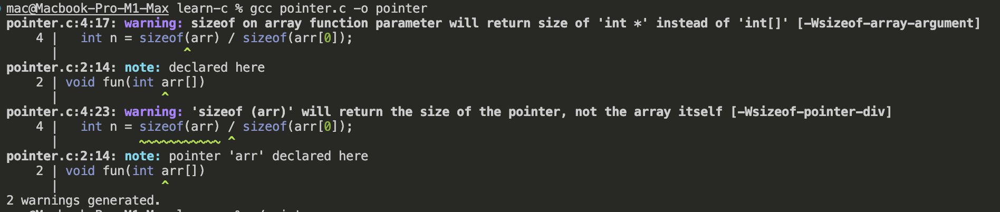

# Pointer

## 1. Addressof and dereference Operator in C

To understand pointer in C programming language, we first need to know about two operators and that are extensively used while working with pointers.

They are:

* **Addressof operator** `&`
  
  Addressof operator is denoted by `&` ampersand symbol and gives you the memory address of a given variable when place before a variable name as shown:
  `&variable_name`

  **Example**

  ```c
  #include <stdio.h>
  int main() {
      int x = 10;
      printf("Address of x: %p\n", &x);
      return 0;
  }
  ```

* **Dereference operator** `*`
  The dereference operator is denoted by `*` asterisk symbol and gives you the value stored at a given memory address stores inside a pointer. It is also placed before the pointer name as shown:

  `*pointer_name`

  The asterisk `*` serves multiple purpose in C:

  - As a dereference operator (unary operator)
  
  * As a multiplication operator (binary operator)
  * In pointer declaration (syntax, not an operator)
  
  **Example**
  
  ```c
  #include <stdio.h>
  int main() {
      int x = 10;
  
      // you can use dereference an addressof variable
      // to access its value
      printf("Value of address of x: %d\n", *&x);
  
      // use asterisk to declare a pointer
      int *xPointer = &x;
      
      // use asterisk as dereference to access value
      // stored at a given memory address
      printf("Value of address of x: %d\n", *xPointer);
      return 0;
  }
  
  // Value of address of x: 10
  // Value of address of x: 10
  ```

## 2. Introduction of Pointer

In C programming, pointers are special types of variables that store memory addresses of other variables.

For example, a pointer to integer stores the address of an integer, and pointer to character stores the address of a character variable

There are 3 ways to declare a pointer as you move the asterisk symbol.

**Syntax**

*  `data_type *pointer_name;`
* `data_type* pointer_name;`
* `data_type * pointer_name;`

**Example**

`short *age, *day;`

### 2.1 **Initialization**

We then store the addressof variable of same data type using address of operator

`data_type *pointer_name = &variable_name;`

This can also be done at declaration

### 2.2 Dereference

Finally we can access the value stored in the memory address using `*` dereference operator

`*pointer_name`

**Example**

```c
#include <stdio.h>
int main() {
    int x = 10;
    int *p = &x;
    printf("Address of x: %p\n", &x);
    printf("Value of address of x: %d\n", *&x);

    printf("Address of x: %p\n", p);
    printf("Value of address of x: %d\n", *p);
    printf("Value of address of p: %p\n", &p);
    return 0;
}
/*
Address of x: 0061FF1C
Value of address of x: 10
Address of x: 0061FF1C
Value of address of x: 10
Value of address of p: 0061FF18
*/

```

### 2.3 Modify values using  pointer

Pointer allow us to modify the values of other variables whose address they store indirectly using dereference operator

```c
#include <stdio.h>
int main() {
    int x = 10;
    int *p;
    p = &x;
    printf("Address of x: %p\n", &x);
    printf("Value of address of x: %d\n", *&x);

    printf("Address of x: %p\n", p);
    printf("Value of address of x: %d\n", *p);
    printf("Value of address of p: %p\n", &p);

    // reassign new value to x
    // pointer will also recognize this change
    x = 20;
    printf("Value of address of x: %d\n", x);
    printf("Value of address of x: %d\n", *p);

    // change value of x via pointer p because it store address of x
    *p = *p + 50;
    printf("Value of address of x: %d\n", x);
    printf("Value of address of x: %d\n", *p);
    return 0;
}

/*
Address of x: 0061FF1C
Value of address of x: 10
Address of x: 0061FF1C
Value of address of x: 10
Value of address of p: 0061FF18

Value of address of x: 20
Value of address of x: 20

Value of address of x: 70
Value of address of x: 70
*/
```

### 2.4 Size of pointer

All pointer variables have the same size regardless of their type whether it is integer, character, double or any other type of pointer.

This size depend on the system architecture. If the system is 64 bits, then pointer can be 64-bit long. If the system is 32 bits, then pointer can be 32-bit long.

```c
#include <stdio.h>

int main()
{
    int age = 10;
    int *p1 = &age;
    printf("%u\n", sizeof(p1));

    char name = "Tuan";
    char *p2 = &name;
    printf("%u\n", sizeof(p2));

    double expense = 100.13123;
    double *p3 = &expense;
    printf("%u\n", sizeof(p3));

    return 0;
}

```

## 3. Application of pointer

### 3.1 **Changing passed parameter**

​	By default, parameters passed to function are passed by value. Whatever change is done to them inside the function does 	not affect the actual variable.

​	Pointers are used when the need is to modify the variables inside a function. Languages like C++ and Java support references 	for such purpose, but C only uses pointers.

### 3.2 **Passing large object efficiently**

In C, passing large objects to functions by value leads to the creation of a copy the entire object into the function's local variables, which is very inefficient. Pointers solve this problem by passing the address of the objects, allowing the function to access it directly without copying.

### 3.3 **Dynamic memory allocation**

Dynamic memory allocation and dellocation in C allow programmers to allocate memory during runtime and release it when no longer needed. Pointers store the address of dynamically allocated memory.

### 3.4 **Implement data structure like Linked List, Tree, Binary Search, etc...**

Data structures like Linked List, trees, and graphs often require nodes that are not stored continuously in memory. Pointers help link these nodes by storing the address of the next nodes thus allows the creation of dynamic and flexible data structures in C.

### 3.5 **System level programming**

Pointers play a major role in multi-threading and inter-process communication. They take care of the shared memory blocks in case multiple processes access them.

### 3.6 **Returning multiple values from Functions**

C functions typically return a single value. However multiple values can be returned by passing the addresses of the variables to the function and storing it in a pointer.

### 3.7 **Accessing array element**

Internally, C uses pointer arithmetic to access elements of arrays. Understanding the relationship between arrays and pointers allows the users to direct access to array elements from anywhere if they have the address.

### 3.8 **Passing arrays to Functions**

Passing larges arrays values by value in C is inefficient, as it requires copying the entirely array. Instead, arrays are passed as pointers, where only the address of the first element is passed, allowing functions to work with the original array efficiently.

## 4. Function Parameters and Pointers in C

In C, whenever any variables is passed in a function normally, a copy of that variables is generated inside the function. This is what we refer to as passing by value.  Whatever change made to the copied variables does not effect the value of the original variable.

**Example**

```c
void fun(int x) {
  x = x + 5;
}

int main() {
  int x = 10;
  fun(x);
  printf("%d", x); // 10
  return 0;
}
```

In this example, value of **x** in `main` function remains unchanged after calling `fun(x)`, even though we modified the value of **x** inside the function. This is because the change was mode to the local copy of **x**, not the original variable.

**Passing parameters as Pointers**

A pointer allows you to pass the memory address of the variable and not its value. With this pointer, you can modify the original variable directly. It is called **passed by reference**. In C, the language does not support references as in C++ or Python, Java, therefore,  the only way to **pass parameters by reference** is by using pointers.

**Example**

```c
void fun(int *ptr) {
  *ptr = *ptr + 5;
}

int main() {
  int x = 10;
  fun(&x);
  printf("%d", x); // 15
  return 0;
}
```

In this example, we pass the address of **x** to the function using the **&** operator. Inside the function, we dereference the pointer using the ***** operator to modify the original value of **x**.

**Application**

Passing pointers to function is helpful in the following purposes:

* Using pointers allows us to **modify the original values of passed parameters** from within a function. This is useful in operations like swap, where we need to exchange values between variables in the calling function.
* **Passing large objects**, such as structures, by value can be inefficient because the entire object is copied into the function's local variable. Pointers allows us to pass only the memory address of the object.

## 5. Array parameters and Pointers

In C, array are always passed to the function as pointers. If not handle properly, this can lead to unexpected results. Consider the below program.

```c
#include <stdio.h>
void fun(int arr[])
{
  int n = sizeof(arr) / sizeof(arr[0]);
  for (int i = 0; i < n; i++)
  {
    printf("%d ", arr[i]);
  }
}

int main()
{
  int arr[] = {1, 2, 5, 3, 40};
  int n = sizeof(arr) / sizeof(arr[0]);
  for (int i = 0; i < n; i++)
  {
    printf("%d ", arr[i]);
  }
  printf("\n");
  fun(arr);
  return 0;
}
// 1 2 5 3 40 
// 1 2
```

Even though the printing code is same in both **main()** and **fun()**, why did **fun()** only printed two elements?

It is because the reason that arrays are passed as pointers. The statement "**sizeof(arr)/sizeof(arr[0])**" will return **4** in **main()**

i.e **(16/4)** which is what we expected. But in **fun()**, same statement returns **2 (8/4)** because here, **arr gets converted to pointer**  whose size is **8 bytes**.

The correct way to pass an array to a function is by passing the size of the array explicitly:

```c
#include <stdio.h>
void fun(int arr[], int n)
{
  for (int i = 0; i < n; i++)
  {
    printf("%d ", arr[i]);
  }
}

int main()
{
  int arr[] = {1, 2, 5, 3, 40};
  int n = sizeof(arr) / sizeof(arr[0]);
  for (int i = 0; i < n; i++)
  {
    printf("%d ", arr[i]);
  }
  printf("\n");
  fun(arr, n);
  return 0;
}
// 1 2 5 3 40 
// 1 2 5 3 40
```

Morden compiler warn against  using sizeof on an array parameter, as it leads to incorrect results. But it is not trustable so always pass the size separately to avoid such issues.



## 6. Pointer Arithmetics

Pointer arithmetic is the set of arithmetic operators that are allowed on pointers in C

They are:

* Incrementing (++) Pointer (both prefix and postfix)
* Decrementing (--) Pointer (both prefix and postfix)
* Adding/Subtraction an integer to/from pointer
* Subtracting one pointer from another

### 6.1 Incrementing Pointer (++)

A pointer can be incremented using both prefix and postfix increment operators.

After incrementing, the value of the pointer is not increased by one, but instead, it is increased by **1* size of the data type** the pointer is pointing to.

```c
#include <stdio.h>
int main() {
    int arr[] = {10, 20, 50, 20};
    int *ptr = arr;
    printf("%d %p\n", *ptr, ptr);
    ptr++;
    printf("%d %p\n", *ptr, ptr);
    return 0;
}

/*
10 0061FF0C
90 0061FF10
*/
```

Because the variable hold the address of the first element of an array, so when we use `*ptr` to dereference the pointer to access the value, it will be the value of the first element in array `10`, And do incrementing by 1, so it will move on 4 bytes in this case (increment by size of the data) to point to the address of the second element of array, so we have value of element 2 is `90`.

### 6.2 Decrementing Pointer (--)

Decrementing works similar to incrementing except that is decreases the pointer by **1 time the size of data type** it is pointing to.

```c
#include <stdio.h>
int main() {
    int arr[] = {10, 20, 50, 20};
    int *ptr = arr;
    printf("%d %p\n", *ptr, ptr);
    ptr++;
    printf("%d %p\n", *ptr, ptr);
    return 0;
}

/*
10 0061FF0C
90 0061FF10
10 0061FF0C
*/
```

### 6.3 Adding/Subtracting an Integer

We can also add or subtract any integer value to/from a pointer. Again, pointer will be moved forward or backward in memory by the **product of the integer and the size of the data type of pointer** not by the integer only.

```c
#include <stdio.h>
int main() {
    int arr[] = {10, 90, 50, 20};
    int *ptr = arr;
    printf("%d %p\n", *ptr, ptr);
    ptr += 3;
    printf("%d %p\n", *ptr, ptr);
    ptr -= 2;
    printf("%d %p\n", *ptr, ptr);
    return 0;
}

/*
10 0061FF0C
20 0061FF18
90 0061FF10
*/
```


Subtracting one pointer from another gives the number of elements between them, not the raw byte difference. This difference is calculated by **dividing the byte difference by the size of the data type of pointer**

```c
#include <stdio.h>
int main() {
    int arr[] = {10, 90, 50, 20};
    int *ptr1 = arr;
    int *ptr2 = ptr1 + 3;
    printf("%d\n", ptr2 - ptr1);
    return 0;
}
// 3
```

In this program, ptr2 is 12 bytes ahead of ptr1 (3 elements * 4 bytes each). The result of `ptr2 - ptr1` is `3`, not `12`, calculated as **byte difference / sizeof(int)**.

## 7. Void Pointer in C

A void pointer is a pointer that has no associated data type with it. It is a generic pointer that can hold the address of any data type such as int*, char*, etc...

**Syntax:** `void * ptr_name;`

Unlike other pointers, void pointers cannot be directly dereferenced. They need to be type casted to the relevant data type for dereferencing. In C, any pointer can be type casted to void pointer and vice versa (C++ only support one-way pointer type casting)

**Example two-way type conversion**

```c
#include <stdio.h>

int main() {
    int x = 30;
    void *p1 = &x; // int address assigned to void pinter
    int *p2 = p1; // cast void pointer to int pointer

    char y = 'G';
    char *p3 = &y;

    p1 = p3; // reassign void pointer p1 by character pointer
    return 0;
}
// Program compiles without error.
```

**Explanation:** void pointer **p1** can hold the address of **int** or **char** without problem.

**Dereferencing void pointers**

```c
#include <stdio.h>
int main() {
    int x = 10;
    void *ptr = &x;
    // we need to cast void pointer into
    // correct data type to dereference to access its value
    printf("Value of x = %d", *(int *) ptr);
    return 0;
}
```

**Applications of void pointers**

Void pointer is mainly used in generic programming such as given below:

* Function like malloc and calloc return **void*** to allocate memory for any data type. It is then converted to the required type by typecasting
* C lacks built-in generics, but void pointers enable generic programming. For example, the **qsort()** function uses **void*** to sort arrays of any type.

## 8. NULL in C

NULL is special value that can be assign to a pointer to indicate that it does not point to any valid memory location.

Initialization of a pointer to NULL means that it doesn't hold a valid memory address. 

Checking for NULL before dereferencing pointer ensure that you're not trying to access some invalid memory location.

You can also initialize a pointer variable that assign by **0**. The **0** literal will work as same as NULL. (Only **0** implicitly work as NULL)

```c
#include <stdio.h>
int main() {
    int *agePtr = 0; // work same as NULL
    if (agePtr)
        printf("Value of ptr is %d", *agePtr);
    else
        printf("agePtr is NULL");
    return 0;
}
// agePtr is NULL
```


### 8.1 Need for NULL

Consider a scenario in which a pointer variable is declared but not initialized immediately. If the code that's supposed to initialize it doesn't execute, then the pointer will hold a random address. 

Dereferencing such a pointer will result in unpredictable behavior just about every time **during the execution** of the program (runtime).

```c
#include <stdio.h>
int main() {
    int *ptr;
    int age = 10;
    char name[] = "Hello";
    printf("Value of ptr: %d", *ptr); // unpredictable value
    return 0;
}
```

**Important Recommendation**

>  Never declare an uninitialized pointer, it will cause accessing random memory address which may lead to unpredictable value. Always assign a variable address to it or assign NULL if you aren't sure which variable to assign to.

Null provides a way to explicitly mark a pointer as invalid when you don't know its valid value yet. It allows you to check if a pointer has been properly initialized before dereferencing it.

```c
#include <stdio.h>
int main() {
    //  BAD
    int *ptr1;
    printf("Value of ptr1: %d", *ptr1);

    // GOOD
    int *ptr2 = NULL;
    if (ptr2 != NULL)
        printf("Value of ptr2: %d", *ptr2);

    return 0;
}
```

**Internal Implementation of NULL**

According to C standard:

* NULL should not point to any valid memory location
* When the integer value 0 is used in a pointer context (where an address is expected), it should be equivalent to NULL

NULL is typically implemented as a macro given below:

`#define NULL (void*)0`

It is typecasted to **void*** so that can be assigned to any pointer.

### 8.2 Application of NULL

NULL is very useful while using pointers which are prone to errors. Following are some common applications NULL is used for:

* NULL is used to indicate that a pointer doesn't hold a valid memory address, whether it's uninitialized or intentionally reset.
* When a function needs to indicate failure or the absence of a result, it can return NULL. For example `malloc` function return NULL if the requested dynamic memory cannot be allocated.
* In data structure like **Linked List** and **Trees**, NULL is used to mark the end of the structure or the absence of a next element.
* NULL evaluates to **false** in a Boolean expression.
