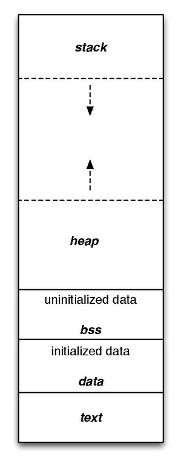

# Day 1: C Language Essentials and Development Environment

## 1. Introduction

C is general-purpose, procedural programming language developed in the early 1970s by [*Dennis Ritchie*](https://en.wikipedia.org/wiki/Dennis_Ritchie) at [**Bell Labs**](https://en.wikipedia.org/wiki/Bell_Labs). 

It's known for its efficiency, control and flexibility.

Despite being nearly 50 years old, C remains one of the most influential and widely used programming language in the world.

**Key characteristics of C:**

* Efficiency: Close to the hardware, minimal runtime overhead
* Portability: Can run on almost any platform with appropriate compiler
* Power and flexibility: Low-level memory access with high-level constructs
* Small core language: Relatively few keywords (~32)
* Rich Ecosystem: Extensive standard library and third-party libraries

**Why is C still relevant today?**

* Operating system (Linux, Unix, Windows kernels)
* Embedded systems and IoT devices
* Performance-critical applications
* System-level programming
* Foundation for others languages (C++ Objective-C, Javascript, Java)
* Database engines and network servers

## 2. Setting up a professional Development Environment 

> This course is designed for experienced developers so I considered you are familiar with these tools.

**2.1 Compiler options:**

* [GCC (GNU Compiler Collection)](https://gcc.gnu.org/): Standard on Linux/macOS
* [Clang](https://clang.llvm.org/): Modern compitler with excellents error messages
* [MinGW](https://www.mingw-w64.org/)/[MSYS2](https://www.msys2.org/): GCC for Windows

**2.2 Build systems:**

* [Make](https://www.gnu.org/software/make/): Traditional build tool for C
* [CMake](https://cmake.org): Modern, cross-platform build system
* [Ninja](https://ninja-build.org/): Fast, lightweight build system

**2.3 Editors/IDE:**

* [VS Code](https://code.visualstudio.com/): with C/C++ extension
* [Clion](https://www.jetbrains.com/clion/): Full-featured C/C++ IDE
* [Vim](https://www.vim.org/)/[Emacs](https://www.gnu.org/software/emacs/): with plugins for experienced users
* And much more, you can searching for it on Google.

**2.4 Debugging Tools:**

* GDB: Standard GNU debugger
* LLDB: LLVM debugger (often used with Clang)
* Valgrind: Memory error detector

**2.5 Version Control:**

* Git: essential for any professional development

## 3. Setup Instructions

**3.1 Linux (Ubuntu/Debian)**

```bash
# Install compiler and essential build tools
sudo apt update
sudo apt install build-essential gdb cmake

# Install version control
sudo apt install git

# Install Valgrind for memory checking
sudo apt install valgrind
```

**3.2 macOS**

```bash
# Install Xcode Command Line Tools (includes clang)
xcode-select --install

# Install Homebrew
/bin/bash -c "$(curl -fsSL https://raw.githubusercontent.com/Homebrew/install/HEAD/install.sh)"

# Install additional tools
brew install cmake valgrind
```

**3.3 Windows**

```bash
# Install MSYS2 from https://www.msys2.org/
# Then open MSYS2 terminal and run:
pacman -Syu
pacman -S mingw-w64-x86_64-gcc mingw-w64-x86_64-gdb mingw-w64-x86_64-cmake
```

## 4. The compilation process

There are 4 main phases in compilation process. Understand this is crucial for effective C programming

**4.1 Preprocessing**

* Expands macros and includes header files
* Processes conditional compilation directives
* Command: `gcc -E file.c -o file.i`

**4.2 Compilation**

* Translate preprocessed code to [assembly language](https://en.wikipedia.org/wiki/Assembly_language)
* Command: `gcc -S file.i -o file.s`

**4.3 Assembly**

* Converts assembly code to object code
* Command: `gcc -c file.s -o file.o`

**4.4 Linking**

* Combines object files with libraries
* Create executable or library
* Command: `gcc file.o -o program`


You can do all steps at once:

```bash
gcc file.c -o program
```

**There are several important compiler flags you might want to use**

* `-Wall -Wextra -Werror`: Enable warnings and treat them as errors
* `-g`: Include debugging information
* `-00`though `-03`: Optimize levels from low to high 
* `--std=c99`or `--std=c11`: Specify C language standard

There are several common C standard you might heard are: [ANSI C, C89, C99, C11, C17, C23](https://en.wikipedia.org/wiki/ANSI_C)

> If you have `gcc version 11+` installed on your computer, default C standard would be C17 + GNU extension. Command to check: `gcc -dM -E - < /dev/null | grep __STDC_VERSION__`

## 5. Basic syntax, functions, and program structure

### **5.1 C Program structure**

```c
// Preprocessor directives
#include <stdio.h>
#define MAX_SIZE 100 // macro to define a constant, preprocessor will replace MAX_SIZE by 100

// global variables and declarations
int global_int_variable;
float global_currency;

// function prototype
void function_name(int param_a);
int calculate_distance(const char *location_a, const char *location_b);

// main function - entry point of C program
int main(int argc, char *argv[]) {

  // local variable declarations
  int age = 30;
  char name[20] = "Tuan";
  
  // statements and expressions
  printf("Hello %s, you are %d year old\n", name, age);
  
  // function calls
  int distance = calculate_distance("Vietnam", "Sweden");
  
  printf("Distance is %d", distance);
  
  /**
  * return exist status of your program to the operating system
  * 0: success execution
  * non-zero: error or specific exit code based on your need
  * example of custom code.
  * 1: generic error
  * 2: misuse of shell commands
  * 127: command not found (linux shells)
  **/
  return 0;
}

// function definition
int calculate_distance(const char *location_a, const char *location_b) {
  printf("Calculating distance between %s and %s\n", location_a, location_b);
  return 10 * MAX_SIZE; // MAX_SIZE is replaced by 100 during preprocessor process.
}
```

**Key components:**

* Preprocessor directives: start with `#` processed before compilation
* Functions: self-contained blocks of code
* `main()` or `main(int argc, char *argv[])`: Special function where execution begin
* Statements: individual instructions ending with semicolons `;`
* Comments: `// single comment`or `/* multi-line comments */` (C99 and later)

### **5.2 Basic syntax and Control Structures**

TODO: To be Continue

## 6. Memory model and Execution flow

Understanding C memory model is essential for effective programming.

**6.1 Memory layout**

1. **Text segment** (`.text`): This segment contains the machine code, also known as the program's instructions or executable code. It's where the compiler translates your C code into the binary instructions that the CPU can understand.
2. **Data segment**:
   * Initialized data (`.data`): This segment holds global and static variables that have been explicitly initialized with a value during their declaration.
   * Uninitialized Data (`.bss`): This segment stores global and static variables that have not been explicitly initialized during their declaration. By convention, these variables are automatically initialized to zero by the operating system when the program starts. The name "Block Started by Symbol" is a legacy from older assemblers. (zeroed at startup)
3. **Heap**: Dynamic memory allocation. Grow upwards, managed via functions like `malloc`, `calloc`, `realloc` and `free`
4. **Stack**: Function calls, local variables, function parameters. Grow downwards, managed automatically by the compiler. Each function call creates a new stack frame, once function returns, the stack is being removed.

**Memory layout visualization**



To have better understanding of memory layout, take a look at code from below:

```c
#include <stdio.h>
#include <stdlib.h>

float global_price_initialized = 199.99; // .data
static int static_global_initialized = 1; // .data

int global_age_not_initialized; // .bss
static double static_global_not_initialized; // .bss

int main() {
  int local_var = 5; // stack
	int *ptr = (int *)malloc(sizeof(int) * 5); // heap
  for (int i = 0; i < 5; i++)
		ptr[i] = i + 1;

  for (int i = 0; i < 5; i++)
    printf("%d \n", ptr[i]);
  free(ptr); // 

  printf("value of .data: %.2f\n", global_price_initialized); // value of .data: 199.99
  printf("value of .bss: %.1f\n", static_global_not_initialized); // value of .bss: 0.0
  return 0;
}
```

**6.2 Execution flow**

1. Program begins at `main()`

2. Function calls push data onto the Stack

3. When a function returns, its stack frame is removed

4. Program continues execution at return point

5. Program terminates when `main()` returns

## 7. Debugging Basics

Debugging is a critical skill for C development.

**7.1 GDB (GNU Debugger)**
