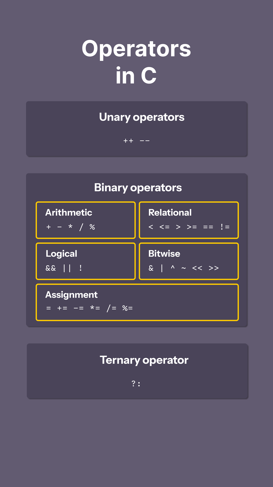

# Operators

Operators are the foundation of any programming language.

Thus the functionality of C language is incomplete without the use of operators. Operators allow us to perform different kinds of operations on operands.

In C, operators can be categorized in following categories:

* Arithmetic operators: `+`, `-`, `*`, `/`, `%`, post-increment, pre-increment, post-decrement, pre-decrement
* Relational operators: `==`, `!=`, `>`, `<`, `>=`, `<=`
* Logical operators: `&&`, `||`, `!`
* Bitwise operators: `&`, `|`, `^`, `~`, `>>`, `<<`
* Assignment operators: `=`, `+=`, `-=`, `*=`, etc...
* Other operators: conditional (ternary), comma, sizeof, address, redirection

| Name             | Type                              | Operator                        |
| ---------------- | --------------------------------- | ------------------------------- |
| Unary operator   | `++`, `--`                        | Unary operator                  |
| Binary operator  | `+`, `-`, `*`, `/`, `%`           | Arithmetic operator             |
|                  | `==`, `!=`, `>`, `<`, `>=`, `<=`  | Relational operator             |
|                  | `&&`, `||`, `!`                   | Logical operator                |
|                  | `&`, `|`, `^`, `~`, `>>`, `<<`    | Bitwise operator                |
|                  | `=`, `+=`, `-=`, `*=`, `/=`, `%=` | Assignment operator             |
| Ternary operator | `?:`                              | Ternary or conditional operator |



## 1. Unary operators

Unary arithmetic operators perform operation on a single operand. Among these, the most commonly used operators are postfix `++`, `--` and prefix increment and decrement operators.

### 1.1 **Increment operator (`++`**)

The `++` operator is used to increment the value of an integer by one.

* When placed before the variable name (pre-increment) its value is incremented instantly.

  ```c
  int x = 10;
  int y = ++x; // pre-increment
  printf("x = %d, y = %d\n", x, y); // x = 11, y = 11
  
  // value of x incremented instantly from 10 to 11
  // then assign 11 to y
  ```

* When placed after the variable name (post-increment) its value is incremented after the evaluation of whole expression

  ```c
  int x = 10;
  int z = x++; // post-increment
  printf("x = %d, z = %d\n", x, z); // x = 11, z = 10
  
  // old value of x (10) assigned to z, then x incremented by 1 (result: x = 11)
  ```

### 1.2 **Decrement operator (`--`**)

The `--` operator is used to decrement the value of an integer by one.

* When placed before the variable name (pre-decrement) its value is decremented instantly

  ```c
  int x = 10;
  int y = --x; // pre-decrement
  printf("x = %d, y = %d\n", x, y); // x = 9, y = 9
  
  // value of x decremented instantly from 10 to 9
  // then assign 9 to y
  ```

* When placed after the variable name (post-decrement) its value is decremented after the evaluation of whole expression

  ```c
  int x = 10;
  int z = x--; // post-decrement
  printf("x = %d, z = %d\n", x, z); // x = 9, z = 10
  
  // old value of x (10) assigned to z, then x decremented by 1 (result: x = 9)
  ```


## 2. Arithmetic operators

There are 5 binary operators such as `+`, `-`, `*`, `/`, `%`

### 2.1 **Addition operator (`+`**)

The `+` operator adds two operands ` 20 + 30 = 50 `

### 2.2 **Subtraction operator (`-`**)

The `-` operator subtracts two operands `30 - 20 = 10`

### 2.3 **Multiplication operator (`*`**)

The `*` operator multiplies two operands `20 * 10 = 200`

### 2.4 **Division operator (`/`**)

The `/` operator divides the first operand by the second. If both operands are integers, the result is truncated to an integer.

```c
8 / 3 = 2.667 // for integers
8.0 / 3.0 = 2.667 // for floating point numbers
```

### 2.5 **Modulus operator (`%`**)

The `%` operator returns the remainder when the first operand is divided by the second

```c
8 % 3 = 2;
```

The sign of the result depends on the sign of the first operand

```c
8 % -3 = 2;
-8 % 3 = -2;
```

Division `/` and remainder `%` operations are undefined when the divisor is zero.

* For integer division: results in a runtime error in most compiler (e.g GCC)
* For floating point division: produces special values such as `INF` (positive infinity) or `-INF` (negative infinity)

## 3. Relational operators

Relational operators are fundamental tools used to compare two values. They evaluate expressions and return Boolean value (true/false) which are represented as `1` for true, and `0` for false.

There are 6 comparison operators in C:

### 3.1 Less than (`<`)

```c
#include <stdbool.h>

const bool is_less_than = 10 < 20; // true
printf("%d", is_less_than); // 1
```

### 3.2 Greater than (`>`)

```c
#include <stdbool.h>

const bool is_less_than = 10 > 20; // false
printf("%d", is_less_than); // 0
```

### 3.3 Less than or equal to (`<=`)

```c
#include <stdbool.h>

const bool is_less_than = 10 <= 20; // true
const bool is_less_than_equal = 20 <= 20; // true
printf("%d %d", is_less_than, is_less_than_equal); // 1 1
```

### 3.4 Greater than or equal to (`>=`)

```c
#include <stdbool.h>

const bool is_less_than = 10 >= 20; // false
const bool is_less_than_equal = 20 >= 20; // true
printf("%d %d", is_less_than, is_less_than_equal); // 0 1
```

### 3.5 Equal to (`==`)

```c
#include <stdbool.h>

const bool is_equal = 10 == 20; // false
const bool is_equal_two = 20 == 20; // true
printf("%d %d", is_equal, is_equal_two); // 0 1
```

### 3.6 Not equal to (`!=`)

```c
#include <stdbool.h>

const bool is_not_equal = 10 != 20; // true
const bool is_not_equal_two = 20 == 20; // false
printf("%d %d", is_not_equal, is_not_equal_two); // 1 0
```

## 4. Assignment operators

Assignment operators are used to assign the value of a variable.

### 4.1 Simple Assignment Operator (`=`)

A simple assigment operator `=` is used to assign the value to a variable

```c
int x = 10; // assign 10 to x
int y = -200; // assign -200 to y
```

### 4.2 Compound Assignment Operators

These operators are used to calculate basic mathematical calculations and assign them to the variable.

They are shorthand notations that improve code readability and reduce redundancy.

* Addition and assign `+=`
* Subtraction and assign `-=`
* Multiplication and assign `*=`
* Division and assign `/=`
* Remainder and assign `%=`

Example

```c
int x = 10, y;
y = x; // y = 10
y += x; // y = 10, x = 10; 10 + 10 = 20; y = 20;
y -= x; // y = 20, x = 10; 20 - 10 = 10; y = 10;
y *= x; // y = 10, x = 10; 10 * 10 = 100; y = 100;
y /= x; // y = 100, x = 10; 100 / 10 = 10; y = 10;
```

## 5. Logical operators

Logical operators take boolean inputs and produce boolean output.

They're commonly used with comparison operators to form more complex expressions.

Categorized into two parts:

* Unary: we have only one logical operator in this category
* Binary: we have logical `AND` and `OR` operators in this category

### 5.1 AND operator (`&&`)

The `&&` operator returns true when both conditions are true, otherwise it returns false.

**Truth table**

| Operand 1 | Operand 2 | `&&` |
| --------- | --------- | ---- |
| 0         | 0         | 0    |
| 1         | 0         | 0    |
| 0         | 1         | 0    |
| 1         | 1         | 1    |

### 5.2 OR operator (`||`)

The `||` operator returns true even if one (or both) of the conditions are true, otherwise it returns false.

**Truth table**

| Operand 1 | Operand 2 | `||` |
| --------- | --------- | ---- |
| 0         | 0         | 0    |
| 1         | 0         | 1    |
| 0         | 1         | 1    |
| 1         | 1         | 1    |

### 5.3 NOT operator (`!`)

The `!` operator returns true if the conditions is not true, otherwise it returns false.

**Truth table**

| Operand | `!`  |
| ------- | ---- |
| 0       | 1    |
| 1       | 0    |

### 5.4 Short-circuiting in Logical Operators

Short-circuiting refers to the behavior of logical operators where evaluation stops as soon as the result is determined. In the case of logical AND, the second expression/condition is not evaluated if the first expression/condition is false. and in logical OR, second expression/condition is not evaluated if the first condition is true.

**Example 1**

```c
int x = 5;
bool result = (x > 10 && x++);
printf("%d %d\n", result, x); // 0 5

// because x is not greater than 10 (false)
// then x++ will be ignore (not being evaludate since the first condition is false)
```

**Example 2**

```c
int x = 5;
bool result = (x++ && x > 10);
printf("%d %d\n", result, x); // 0 6

// Step 1:
// x++ return 5 because this is post-increment
// then it incremented by 1 so we have 6
// in binary representation any integer that is not 0 is true
// so x++ return 5 will be consider as true

// Step 2:
// since the left operand is true, now evaluate the right operand x > 10
// x is now 6
// 6 < 10 so operand x > 10 is false (or 0)

// Step 3:
// combine with AND operator we have
// 5 (true) && 0

// so result = 0
// x incremented to 6
```

**Example 3**

```c
int x = 5;
bool result = (x > 2 || x++);
printf("%d %d", result, x); // 1 5

// Step 1:
// x > 2 return true (or 1)

// Step 2:
// OR operator just need one operand to being true, it will not evaluate the second operand
// so x++ will be ignored
```

## 6. Bitwise operators

Bitwise operators work on the binary representation of integers, operating bit by bit to perform logical operations.

**These operators are incredibly faster than arithmetic and other operators (5-20x faster) due to its simplicity as a single CPU instruction**

There are a total 6 bitwise operators in C.

### 6.1 Bitwise AND (`&`)

Bitwise `AND` operator takes two numbers as operands and does `AND` on every bit of two numbers.

The result of `AND` is `1` only if both bits are 1, otherwise the result is `0`

* **Analogy**: Like a gate that only opens (`1`) when both keys (operands) are present (`1`)
* **Mnemonic**: Both must agree (`A` & `B` = 1 only if both are `1`)
* **Use**: Masking (e.g checking specific flags)

**Example 1**

```c
int x = 3, y = 6;
int result = x & y; // 2

// 0011 & 0110 = 0010 (2 in decimal)
```

| Operand | Binary  | Operator     |
| ------- | ------- | ------------ |
| 3       | 0 0 1 1 | &            |
| 6       | 0 1 1 0 |              |
| Result  | 0 0 1 0 | 2 in decimal |

**Example 2**

Using bitwise `AND` operator to check a number is odd or even.

```c
#include <stdio.h>
#include <stdbool.h>

bool is_odd(int input) {
  return input & 1; // faster than % 2
}

int main(void) {
    printf("%d\n", is_odd(1)); // true
    printf("%d\n", is_odd(2)); // false
    printf("%d\n", is_odd(3)); // true
    return 0;
}

```


### 6.2 Bitwise OR (`|`)

Bitwise `OR` operator takes two numbers as operands and does `OR` on every bit of two numbers.

The result of `OR` is `1` if any one of them is `1`

* **Analogy**: Like a light switch where either switch (`A` or `B`) can turn it on (`1`)
* **Mnemonic**: One or the other (`|` looks like a pipe allowing flow from either side)
* **Use**: Setting flags

**Example 1**

```c
int x = 3, y = 6;
int result = x | y;

// 0011 | 0110 = 0111 (7 in decimal)
```

| Operand | Binary  | Operator     |
| ------- | ------- | ------------ |
| 3       | 0 0 1 1 | \|           |
| 6       | 0 1 1 0 |              |
| Result  | 0 1 1 1 | 7 in decimal |

### 6.3 Bitwise XOR (`^`)

Bitwise `XOR` operator takes two numbers as operands and does `XOR` on every bit of two numbers.

The result of `XOR` is `1` if two bits are different, otherwise the result is `0`

* **Analogy**: Like a toggle switch - flips state if inputs differ
* **Mnemonic**: X marks the eXclusive spot (`^` looks like an arrow pointing to differents)
* **Use**: Toggling bits, encryption

```c
int x = 3, y = 6;
int result = x ^ y;

// 0011 ^ 0110 = 0101 (5 in decimal)
```

| Operand | Binary  | Operator     |
| ------- | ------- | ------------ |
| 3       | 0 0 1 1 | ^            |
| 6       | 0 1 1 0 |              |
| Result  | 0 1 0 1 | 5 in decimal |

### 6.4 Bitwise NOT (`~`)

Bitwise `NOT` operator is a unary operator (**perform on one operand**) that inverts all the bits of its single operand. 

All `0` become `1`, and all `1` become `0`.

* **Analogy**: Like flipping a switchboard - every light toggles state
* **Mnemonic**: Negate everything (`~` looks wavy, like flipping everything)
* **Use**: Clearing flags, creating masks

**Example 1**

```c
int x = 3; // Signed integer
int result = ~x;
printf("%d", result); // 4

// 0011 flipped to 0100
// The first bit is for sign of int (0 mean positive number, 1 mean negative number)
```

| Operand           | Binary | Operator     |
| ----------------- | ------ | ------------ |
| 3                 | 0011   | `~`          |
| Invert every bits | 0100   | 4 in decimal |

**Example 2**

```c
int x = -3; // Signed integer
int result = ~x;
printf("%d", result);
```

| Operand           | Binary | Operator     |
| ----------------- | ------ | ------------ |
| -3                | 1101   | `~`          |
| Invert every bits | 0010   | 2 in decimal |

**Example 3**

```c
unsigned int x = 3;
int result = ~x;
printf("%d", result); // -4
```

| Operand           | Binary (32 bits)                        | Operator      |
| ----------------- | --------------------------------------- | ------------- |
| 3                 | 0000 0000 0000 0000 0000 0000 0000 0011 | `~`           |
| Invert every bits | 1111 1111 1111 1111 1111 1111 1111 1100 | -4 in decimal |

### 6.5 Bitwise Left Shift (`<<`)

This operator shifts the bits of the left operand to the left by the number of positions specified by the right operand.

Empty positions on the right are filled with 0s.

This effectively multiplies the number by powers of 2.

* **Analogy**: Like multiplying by powers of 2 (e.g `x << 1` is `x * 2`)

* **Mnemonic**: Launch left (`<<` points left, pushing bits that way)
* **Use**: Fast multiplication, bit field alignment

**Example 1**

```c
int x = 3;
int result = x << 1;
printf("%d", result); // 6
```

| Operand                                                      | Binary | Operator     |
| ------------------------------------------------------------ | ------ | ------------ |
| 3                                                            | 0011   | `<<`         |
| Pushing bits to the left, empty position on the right are filled with `0` | 0110   | 6 in decimal |

**Example 2**

```c
int x = -3;
int result = x << 1;
printf("%d", result); // -6
// -3:                       1111 1111 1111 1111 1111 1111 1111 1101
// pushing bits to the left: 1111 1111 1111 1111 1111 1111 1111 1010

```

| Operand                                                      | Binary | Operator     |
| ------------------------------------------------------------ | ------ | ------------ |
| -3                                                           | 1101   | `<<`         |
| Pushing bits to the left, empty position on the right are filled with `0` | 1010   | 6 in decimal |

### 6.6 Bitwise Right Shift (`>>`)

This operator shifts the bits of the left operand to the right by the number of positions specified by the right operand.

Empty positions on the left are filled based on the data type (0s for unsigned integers, and typically the sign bit for signed integers).

This effectively divides the number by powers of 2.

* **Analogy**: Like dividing by powers of 2 (e.g `x >> 1` is `x / 2`)
* **Mnemonic**: Rush right (`>>` points right, moving bits there)
* **Use**: Fast division, extracting bit fields

**Example 1**

```c
int x = 3;
int result = x >> 1;
printf("%d", result); // 1
```

| Operand                                                      | Binary | Operator     |
| ------------------------------------------------------------ | ------ | ------------ |
| 3                                                            | 0011   | `>>`         |
| Pushing bits to the right, empty position on the right are filled with `0` | 0001   | 1 in decimal |

**Example 2**

```c
int x = -3;
int result = x >> 1;
printf("%d", result); // -2
```

| Operand                                                      | Binary | Operator      |
| ------------------------------------------------------------ | ------ | ------------- |
| -3                                                           | 1101   | `>>`          |
| Pushing bits to the right, empty position on the right are filled with `0` | 1110   | -2 in decimal |


**Complex example of Linux permission**

```c
#include <stdio.h>
#include <stdint.h>

// Permission bitmasks (9-bit permissions)
#define OWNER_READ   (1U << 8) // 400 octal
#define OWNER_WRITE  (1U << 7) // 200 octal
#define OWNER_EXEC   (1U << 6) // 100 octal

#define GROUP_READ   (1U << 5) // 040 octal
#define GROUP_WRITE  (1U << 4) // 020 octal
#define GROUP_EXEC   (1U << 3) // 010 octal

#define OTHERS_READ  (1U << 2) // 004 octal
#define OTHERS_WRITE (1U << 1) // 002 octal
#define OTHERS_EXEC  (1U << 0) // 001 octal

// Prints permissions in rwxrwxrwx format
void print_permissions(uint16_t perms) {
    // Owner permissions
    putchar(perms & OWNER_READ  ? 'r' : '-');
    putchar(perms & OWNER_WRITE ? 'w' : '-');
    putchar(perms & OWNER_EXEC  ? 'x' : '-');
  
    // Group permissions
    putchar(perms & GROUP_READ  ? 'r' : '-');
    putchar(perms & GROUP_WRITE ? 'w' : '-');
    putchar(perms & GROUP_EXEC  ? 'x' : '-');
  
    // Others permissions
    putchar(perms & OTHERS_READ  ? 'r' : '-');
    putchar(perms & OTHERS_WRITE ? 'w' : '-');
    putchar(perms & OTHERS_EXEC  ? 'x' : '-');
    printf(" (octal: %o)\n", perms & 0777); // Mask to 9 bits
}

// Grants a permission using OR
uint16_t grant_permission(uint16_t perms, uint16_t flag) {
    return perms | flag; // Set specified bit
}

// Revokes a permission using AND and NOT
uint16_t revoke_permission(uint16_t perms, uint16_t flag) {
    return perms & ~flag; // Clear specified bit
}

// Toggles a permission using XOR
uint16_t toggle_permission(uint16_t perms, uint16_t flag) {
    return perms ^ flag; // Flip specified bit
}

int main(void) {
    uint16_t perms = 0644; // rw-r--r-- (octal)

    printf("Initial: ");
    print_permissions(perms);

    // Grant group write permission
    perms = grant_permission(perms, GROUP_WRITE);
    printf("After granting group write: ");
    print_permissions(perms);

    // Revoke others read permission
    perms = revoke_permission(perms, OTHERS_READ);
    printf("After revoking others read: ");
    print_permissions(perms);

    // Toggle owner execute permission
    perms = toggle_permission(perms, OWNER_EXEC);
    printf("After toggling owner execute: ");
    print_permissions(perms);

    // Demonstrate shift for bit alignment (e.g., move owner to group)
    uint16_t owner_bits = (perms >> 6) & 07; // Extract owner bits
    printf("Owner bits shifted to group position: %o\n", owner_bits << 3);

    return 0;
}

/* Result

Initial: rw-r--r-- (octal: 644)
After granting group write: rw-rw-r-- (octal: 664)
After revoking others read: rw-rw---- (octal: 660)
After toggling owner execute: rwxrw---- (octal: 760)
Owner bits shifted to group position: 70
*/
```

## 7. Ternary Operator

The `?:` operator that evaluates an expression based on a condition, returning one of two values.

* **Analogy**: The ternary operator is like a quick decision at a fork in the road: If this is true, go left, otherwise go right
* **Mnemonic**: Question mark, pick a patch: true or false

```c
int x = 3;
int result = (x > 5) ? 100 : 200;
// if x > 5 return 100, otherwise return 200
```

## 8. Operator precedence & associativity

**Operator Precedence** determines the order in which operators are evaluated in an expression when multiple operators are present. Operators with higher precedence are evaluated first. Use `()` to override precedence, forcing evaluation in the desired order.

**Operator Associativity** determines the order of evaluation when operators have the **same precedence**. It can be:

- **Left-to-right**: Operators are evaluated from left to right (e.g., arithmetic operators like `+`, `-`).
- **Right-to-left**: Operators are evaluated from right to left (e.g., assignment operators like `=`).

| Precedence | Operator             | Description                                    | Associativity |
| ---------- | -------------------- | ---------------------------------------------- | ------------- |
| 1          | `()`                 | Parentheses                                    | Left-to-right |
| 2          | `!`, `~`, `++`, `--` | Logical NOT, Bitwise NOT, Increment, Decrement | Right-to-left |
| 3          | `*`, `/`, `%`        | Multiplication, Division, Modulo               | Left-to-right |
| 4          | `+`, `-`             | Addition, Subtraction                          | Left-to-right |
| 5          | `<<`, `>>`           | Bitwise Left Shift, Right Shift                | Left-to-right |
| 6          | `<`, `<=`, `>`, `>=` | Relational operators                           | Left-to-right |
| 7          | `==`, `!=`           | Equality operators                             | Left-to-right |
| 8          | `&`                  | Bitwise AND                                    | Left-to-right |
| 9          | `^`                  | Bitwise XOR                                    | Left-to-right |
| 10         | `                    | `                                              | Bitwise OR    |
| 11         | `&&`                 | Logical AND                                    | Left-to-right |
| 12         | `                    |                                                | `             |
| 13         | `?:`                 | Ternary operator                               | Right-to-left |
| 14         | `=`                  | Assignment                                     | Right-to-left |
| 15         | `,`                  | Comma                                          | Left-to-right |

* **Analogy**: Operator precedence is like a kitchen recipe - some steps (e.g chop ingredients) must happen before others (e.g mix). Associativity is the order you chop multiple ingredients (left to right or right to left)
* **Mnemonic**: High precedence acts first, same precedence check associativity

```c
#include <stdio.h>

int main(void) {
    int a = 2, b = 3, c = 4;

    // Precedence: * before +
    int result1 = a + b * c; // 2 + (3 * 4) = 14
    printf("a + b * c = %d\n", result1);

    // Parentheses override precedence
    int result2 = (a + b) * c; // (2 + 3) * 4 = 20
    printf("(a + b) * c = %d\n", result2);

    // Associativity: = is right-to-left
    int x, y, z;
    x = y = z = 5; // z = 5, then y = z, then x = y
    printf("x = %d, y = %d, z = %d\n", x, y, z);

    // Bitwise: & before |
    int result3 = a & b | c; // (2 & 3) | 4
    printf("a & b | c = %d\n", result3); // (2 & 3 = 2) | 4 = 6

    return 0;
}
```

