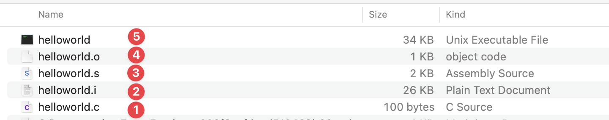

# Day 1: C Language Essentials and Development Environment

## 1. Introduction

C is general-purpose, procedural programming language developed in the early 1970s by [*Dennis Ritchie*](https://en.wikipedia.org/wiki/Dennis_Ritchie) at [**Bell Labs**](https://en.wikipedia.org/wiki/Bell_Labs).

It's known for its efficiency, control and flexibility.

Despite being nearly 50 years old, C remains one of the most influential and widely used programming language in the world.

**Key characteristics of C:**

* Efficiency: Close to the hardware, minimal runtime overhead
* Portability: Can run on almost any platform with appropriate compiler
* Power and flexibility: Low-level memory access with high-level constructs
* Small core language: Relatively few keywords (~32)
* Rich Ecosystem: Extensive standard library and third-party libraries

**Why is C still relevant today?**

* Operating system (Linux, Unix, Windows kernels)
* Embedded systems and IoT devices
* Performance-critical applications
* System-level programming
* Foundation for others languages (C++ Objective-C, Javascript, Java)
* Database engines and network servers

### Pros and cons of C

**Pros**

- Efficicency: C is fast and efficient language that can be used to create high-performance applications, especially on a low/cheap hardware (i.e ESP32)
- Portability: C can be compiled and run on wide range of platforms and operating systems
- Low-level access: C provides low-level access to system resources, making it ideal for systems programming and developing operating systems.
- Widely used: C is widely used language, many modern programming languages are built on top of it (Go, JS, Java, Python etc...)

**Cons**

- Difficult: especially for beginners due it its complex syntax and low-level access to system resources
- Lack of memory management: C does not provide automatic memory management which can lead to memory leaks and other memory related bugs if not handled properly 
- No built-in support for OOP: C is procedural programming language so it is not designed to write OOP applications.
- No built-in support for concurrency: it more difficult to write multithreaded applications compared to languages like Java or Go
- Security vulnerabilities: C programs are prone to security vulnerabilities, such as buffer overflows, if not written carefully. (You need to maintain memory carefully)

Overall C is a powerfull language with many advantages, but also requires a high degree of expertise to use effectively and has some potential drawbacks, especially for beginners or developers working on complex projects.

>  Manage memory manually is hard but not impossible, I can do it so you can also do it. Just need to follow an effective strategy. Everything will be alright, don't worries.

## 2. Setting up a professional Development Environment

> This course is designed for experienced developers so I considered you are familiar with these tools.

**2.1 Compiler options:**

* [GCC (GNU Compiler Collection)](https://gcc.gnu.org/): Standard on Linux/macOS
* [Clang](https://clang.llvm.org/): Modern compiler with excellents error messages
* [MinGW](https://www.mingw-w64.org/)/[MSYS2](https://www.msys2.org/): GCC for Windows

**2.2 Build systems:**

* [Make](https://www.gnu.org/software/make/): Traditional build tool for C
* [CMake](https://cmake.org): Modern, cross-platform build system
* [Ninja](https://ninja-build.org/): Fast, lightweight build system

**2.3 Editors/IDE:**

* [VS Code](https://code.visualstudio.com/): with C/C++ extension (free)
* Xcode: available on MacOS (free)
* [Vim](https://www.vim.org/)/[Emacs](https://www.gnu.org/software/emacs/): with plugins for experienced users (free)
* [Clion IDE](https://www.jetbrains.com/clion/): Nice and efficient IDE for C and C++ (paid and free edition)
* [CodeBlocks](https://www.codeblocks.org/downloads/): Free and lightweight IDE
* And much more, you can searching for it on Google Search

**2.4 Debugging Tools:**

* GDB: Standard GNU debugger
* LLDB: LLVM debugger (often used with Clang)
* Valgrind/Leaks: Memory error detector
* Built-in feature of Clion IDE

**2.5 Version Control:**

* Git: essential for any professional development

## 3. Setup Instructions

**3.1 Linux (Ubuntu/Debian)**

```bash
# Install compiler and essential build tools
sudo apt update
sudo apt install build-essential gdb cmake

# Install version control
sudo apt install git

# Install Valgrind for memory checking
sudo apt install valgrind
```

**3.2 macOS**

```bash
# Install Xcode Command Line Tools (includes clang)
xcode-select --install

# Install Homebrew
/bin/bash -c "$(curl -fsSL https://raw.githubusercontent.com/Homebrew/install/HEAD/install.sh)"

# We use leaks on Mac since it don't require additional package being installed on your Mac
# and Valgrind is not compatible with M-series Chip

# Enable stack logs
export MallocStackLogging=1

# Execute your program, stack logs being generated
./your_program

# check for memory leak, it will notice which line of code are leaking
leaks --atExit --list -- ./your_program

# checkout this video for more details
# https://youtu.be/bhhDRm926qA?si=Z64UnODOtYoBFhwn

```

**3.3 Windows**

```bash
# Install MSYS2 from https://www.msys2.org/
# Then open MSYS2 terminal and run:
pacman -Syu
pacman -S mingw-w64-x86_64-gcc mingw-w64-x86_64-gdb mingw-w64-x86_64-cmake
```

## 4. The compilation process

There are 4 main phases in compilation process. Understand this is crucial for effective C programming

**4.1 Preprocessing**

* Removal of comments
* Expansion of macros
* Expansion of includes header files
* Conditional compilation directives

Command: `gcc -E helloworld.c -o helloworld.i`

**4.2 Compilation**

* Translate preprocessed code to [assembly language](https://en.wikipedia.org/wiki/Assembly_language)
* Command: `gcc -S helloworld.i -o helloworld.s`

**4.3 Assembly**

* Converts assembly code to object code
* Command: `gcc -c helloworld.s -o helloworld.o`

**4.4 Linking**

* Combines object files with libraries
* Create executable or library

Linking can be 2 types:

- Static linking: all the code is copied to the single file and then executable file is created
- Dynamic linking: Only the names of the shared libraries is added to the code and then it is referred during the execution

Command: `gcc helloworld.o -o helloworld`


Take a look at compiled files to have better understanding.



Each command from above is just for explanation, you can directly compile C code into executable file like command from below:

```bash
gcc helloworld.c -o helloworld
```

**There are several important compiler flags you might want to use**

* `-Wall -Wextra -Werror`: Enable warnings and treat them as errors
* `-g`: Include debugging information
* `-00` though `-03`: Optimize levels from low to high 
* `--std=c99`or `--std=c11`: Specify C language standard

There are several common C standard you might heard are: [ANSI C, C89, C99, C11, C17, C23](https://en.wikipedia.org/wiki/ANSI_C)

> If you have `gcc version 11+` installed on your computer, default C standard would be C17 + GNU extension. Command to check: `gcc -dM -E - < /dev/null | grep __STDC_VERSION__`

## 5. Basic syntax, functions, and program structure

### **5.1 C Program structure**

```c
// Preprocessor directives
#include <stdio.h>
#define MAX_SIZE 100 // macro to define a constant, preprocessor will replace MAX_SIZE by 100

// global variables and declarations
int global_int_variable;
float global_currency;

// function prototype
void function_name(int param_a);
int calculate_distance(const char *location_a, const char *location_b);

typedef struct User {
  char *fullname;
  short age;
  float salary;
  float expenses;
};

// main function - entry point of C program
int main(int argc, char *argv[]) {

  // local variable declarations
  int age = 30;
  char name[20] = "Tuan";
  
  // statements and expressions
  printf("Hello %s, you are %d year old\n", name, age);
  
  // function calls
  int distance = calculate_distance("Vietnam", "Sweden");
  User me = {
    .fullname = "Tuan Nguyen",
    .age = 36,
    .salary = 10.1234,
    .expenses = 1.23
  };
  
  struct Profile {
      char *name;
      short age;
      bool willing_to_relocate;
      float min_monthly_income;
      char *currency;
  } const me = {
      .name = "Tuan Nguyen Anh",
      .age = 36,
      .willing_to_relocate = true,
      .min_monthly_income = 100.12,
      .currency = "VND"
  };
  
  printf("Distance is %d", distance);
  
  /**
  * return exist status of your program to the operating system
  * 0: success execution
  * non-zero: error or specific exit code
  * example of custom code.
  * 1: generic error
  * 2: misuse of shell commands
  * 127: command not found (linux shells)
  **/
  return 0;
}

// function definition
int calculate_distance(const char *location_a, const char *location_b) {
  printf("Calculating distance between %s and %s\n", location_a, location_b);
  return 10 * MAX_SIZE; // MAX_SIZE is replaced by 100 during preprocessor process.
}
```

**Key components:**

* Preprocessor directives: start with `#` processed before compilation
* Functions: self-contained blocks of code
* `main()` or `main(int argc, char *argv[])`: Special function where execution begin
* Statements: individual instructions ending with semicolons `;`
* Comments: `// single comment`or `/* multi-line comments */` (C99 and later)


**Do you wonder why the `main` function needs to return an `int`?**

In C, the language standard requires `main` to return an integer. This integer becomes the program’s **exit code**, which the operating system records when the program finishes.

This is not unique to C — **every program in any programming language** runs as a process in the operating system, and every process has:

- A **PID** (Process ID) so the OS can track and manage it.
- An **exit code** so the OS and other programs can know how it finished.

If you don’t explicitly set an exit code, your language runtime will set one for you (usually `0` for success). Parent processes (like a shell, script, or service manager) can then use this exit code to trigger specific actions — such as logging, restarting a service, or showing an error message.

I have several documents for exit code:

- https://www.ditig.com/linux-exit-status-codes#list-of-standard-exit-codes
- https://www.agileconnection.com/article/overview-linux-exit-codes
- https://learn.microsoft.com/en-us/windows/win32/debug/system-error-codes--0-499-
- https://developer.apple.com/library/archive/documentation/System/Conceptual/ManPages_iPhoneOS/man3/sysexits.3.html

### **5.2 Basic syntax and Control Structures**

#### 5.2.1 Variables and Data Types

Define variables by following pattern: `[data_type] [variable_name] = [initial_value];`

Don't forget to end a line of code with semicolon `;`

`Initial_value` is optional, you are free to assign value to that variable in the future

```c
char letter_c = "c";
char *name = "Nguyen Anh Tuan";
short age = 36;
unsigned int i = 10; // full options example
int i = 10; // without modifier
int i; // without modifier and initial value;
unsigned int i; // without initial value
```

**Rules for naming variables**

- Must start with a letter or underscore `_`
- Can contain letters, digits, and underscore `_`
- Cannot use C keywords (`int`, `return`, `if` etc...)
- Case-sensitive (`fullName` and `fullname` are different)

**Data types**

| Data Type        | Size (typical) | Format Specifier | Example Value            |
| ---------------- | -------------- | ---------------- | ------------------------ |
| `int`            | 2 or 4 bytes   | `%d` / `%i`      | `42`                     |
| `float`          | 4 bytes        | `%f`             | `3.14`                   |
| `double`         | 8 bytes        | `%lf`            | `3.14159265`             |
| `char`           | 1 byte         | `%c`             | `'A'`                    |
| `_Bool` / `bool` | 1 byte         | `%d`             | `1` (true) / `0` (false) |
| `long`           |                |                  |                          |

> To use `bool` data type, you have to include `stdbool.h` it got dropped support since C99

**Tips**: to storing currency value in your program, I recommend to use type `long long` (64 bits signed integer). No floating-rounding errors, percise arithmetic, easy comparison. If you don't want negative value, use `unsigned long long` 


C has several fundamental data types such as:

```c
// Integer
int i = 10; // standard integer (-2 billion to 2 billion)

short s = 10; // short integer (-32,768 to 32,768)
short int s2 = 10; // short integer

long a = 1000L; // Long integer
long long a2 = 10000L; // Long long integer (C99)

// unsigned versions
unsigned j = 10u;
unsigned int age = 255; // 0 to 255
unsigned short e = 65535; // 0 to 65,535
unsigned short int f = 65535; // 0 to 65,535
unsigned char d = 255; // 0 to 255, mostly used to read/write file byte to byte. You're treating the file as a raw sequence of bytes (not text or structured data)

// character
char c = 'A'; // Single char (-128 to 128)
char name[20] = "Tuan"; // String with maximum 20 characters

// Floating point
float price = 19.99f; // single precision (6-7 digits after the floating point)
double salary = 123456; // double precision (15-16 digits precision)
long double ld = 3.14L; // extended precision

// boolean (C99)
#include <stdbool.h>
bool enabled = true; // true/false
```

**Data types sizes and ranges** (based on architectural and following [IEEE-754 floating point standard](https://en.wikipedia.org/wiki/IEEE_754))

| Type            | Size                                        | Value Range Signed              | Value Range Unsigned |
| --------------- | ------------------------------------------- | ------------------------------- | -------------------- |
| char            | 1 byte (8 bits)                             | -128 to 127                     | 0 to 255             |
| short/short int | 2 bytes (16 bits)                           | -32,768 to 32,767               | 0 to 65,535          |
| int             | 4 bytes (32 bits)                           | -2,147,483,648 to 2,147,483,647 | 0 to 4,294,967,295   |
| long            | 4 bytes (32 bits) / 8 bytes (64 bits)       |                                 |                      |
| long long       | 8 bytes (64 bits)                           |                                 |                      |
| float           | 4 bytes (32 bits)                           |                                 | Not Applicable       |
| double          | 8 bytes (64 bits)                           |                                 | Not Applicable       |
| long double     | typically 16 bytes (x86), 8 or 12 on others |                                 | Not Applicable       |

**Note**:

* `char` can be signed or unsigned depending on the compiler (usually signed on x86, but not guaranteed!).

* `unsigned` versions start from `0` and double the max value of their signed counterpart (but no negative numbers).

* Floating-point (`float`, `double`, `long double`) use IEEE-754 and aren’t simple integer ranges; instead, they have a precision and an exponent range.

* `float` `double` `long double` don't have signed or unsigned  versions in C language. They always signed and can represent both positive and negative numbers including `NaN` `+Infinity` `-Infinity`

  ```c
  unsigned int a = 10;  // valid
  unsigned float b = 3.14f;  // invalid! compiler error
  ```

* `long` size is platform-dependent:

  - On **LP32** systems (older 32-bit) — 4 bytes
  - On **LP64** systems (modern Linux 64-bit) — 8 bytes

```c
// Check exact sizes on your system
#include <stdio.h>
#include <limits.h>
#include <float.h>

int main() {
    printf("char: %d to %d\n", CHAR_MIN, CHAR_MAX);
    printf("short: %d to %d\n", SHRT_MIN, SHRT_MAX);
    printf("int: %d to %d\n", INT_MIN, INT_MAX);
    printf("long: %ld to %ld\n", LONG_MIN, LONG_MAX);
    printf("long long: %lld to %lld\n", LLONG_MIN, LLONG_MAX);
    printf("float: %e to %e\n", FLT_MIN, FLT_MAX);
    printf("double: %e to %e\n", DBL_MIN, DBL_MAX);
    printf("long double: %Le to %Le\n", LDBL_MIN, LDBL_MAX);
    return 0;
}
```

## 5.2 Commenting

Comment being use for explanation purposes. Sometimes you want to explain or take not in your code, that's completely natural and reasonable.

**Single line comment**:

```c
// this is a single line comment
// more line
// one more
```

**Multiple line comment**

```c
/* this
is
multiple lines
commenting /*

/**
 * or you can
 * write multiple lines
 * like this, elegant and 
 * beautiful
 */

/**
 * @brief Do sum 2 numbers
 * @param a number one
 * @param b number two
 * @return total
 */
float sum(float a, float b) {
    return a + b;
}
```

**Best practices:**

* Write comments that are easy to understand
* Do not comment on every line unnecessarily and avoid writing obvious comments
* Update comments regulary
* Focus on explaining the intent behind the code rather than restating the obvious 

```c
// BAD

// Calculate something
int calc(int a, int b) {}

// Function to calculate total price
// Take base price
// Take tax rate
// Adds them together
// Return the total
long long total_price(long long base_price, double tax_rate) {
	return base_price + (long long)(base_price * (tax_rate / 100.0));
}


// GOOD
/**
 * @brief  Calculate the total price including tax.
 *
 * @param base_price  The base price in cents.
 * @param tax_rate    The tax rate as a percentage (e.g., 5.0 for 5%).
 *
 * @return The total price in cents.
 *
 * @note This function truncates fractional cents.
 */
long long total_price(long long base_price, double tax_rate) {
  // Apply tax and cast to integer cents
  return base_price + (long long)(base_price * (tax_rate / 100.0));
}
```


## 6. Memory model and Execution flow

Understanding C memory model is essential for effective programming.

**6.1 Memory layout**

1. **Text segment** (`.text`): This segment contains the machine code, also known as the program's instructions or executable code. It's where the compiler translates your C code into the binary instructions that the CPU can understand. This segment is read-only to prevent accidental modification of instructions.
2. **Data segment**:
   * Initialized data (`.data`): This segment holds global and static variables that have been explicitly initialized with a value during their declaration.
   * Uninitialized Data (`.bss`): This segment stores global and static variables that have not been explicitly initialized during their declaration. By convention, these variables are automatically initialized to zero by the operating system when the program starts. The name "Block Started by Symbol" is a legacy from older assemblers. (zeroed at startup)
3. **Heap**: Dynamic memory allocation. Grow upwards, managed via functions like `malloc`, `calloc`, `realloc` and `free`
4. **Stack**: Function calls, local variables, function parameters. Grow downwards, managed automatically by the compiler. Each function call creates a new stack frame, once function returns, the stack is being removed.

**Memory layout visualization**


To have better understanding of memory layout, take a look at code from below:

```c
#include <stdio.h>
#include <stdlib.h>

float global_price_initialized = 199.99; // .data
static int static_global_initialized = 1; // .data

int global_age_not_initialized; // .bss
static double static_global_not_initialized; // .bss

int main() {
  int local_var = 5; // stack
	int *ptr = (int *)malloc(sizeof(int) * 5); // heap
  for (int i = 0; i < 5; i++)
		ptr[i] = i + 1;

  for (int i = 0; i < 5; i++)
    printf("%d \n", ptr[i]);
  free(ptr); // 

  printf("value of .data: %.2f\n", global_price_initialized); // value of .data: 199.99
  printf("value of .bss: %.1f\n", static_global_not_initialized); // value of .bss: 0.0
  return 0;
}
```

**6.2 Execution flow**

1. Program begins at `main()`

2. Function calls push data onto the Stack

3. When a function returns, its stack frame is removed

4. Program continues execution at return point

5. Program terminates when `main()` returns

## 7. Debugging Basics

Debugging is a critical skill for C development.

**7.1 GDB (GNU Debugger)**
