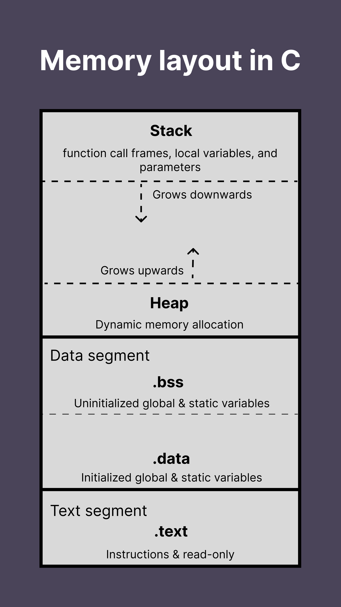

# Day 1: C Language Essentials and Development Environment

## 1. Introduction

C programming language is one of earliest high-level languages developed in 1972 by [*Dennis Ritchie*](https://en.wikipedia.org/wiki/Dennis_Ritchie) at [**Bell Labs**](https://en.wikipedia.org/wiki/Bell_Labs).

Initially developed as a system programming language, it still remains one of the most popular programming languages used for low level programming, system software, embedded system kernel etc...

**Key characteristics of C:**

* Efficiency: Close to the hardware, minimal runtime overhead
* Portability: Can run on almost any platform with appropriate compiler
* Power and flexibility: Low-level memory access with high-level constructs
* Small core language: Relatively few keywords (~32)
* Rich Ecosystem: Extensive standard library and third-party libraries

**Why is C still relevant today?**

* Operating system (Linux, Unix, Windows kernels)
* Embedded systems and IoT devices
* Performance-critical applications
* System-level programming
* Foundation for others languages (C++, Objective-C, Javascript, Java)
* Database engines (MySQL, Oracle) and network servers

### Pros and cons of C

**Pros**

- Efficicency: C is fast and efficient language that can be used to create high-performance applications, especially on a low/cheap hardware (i.e ESP32)
- Portability: C can be compiled and run on wide range of platforms and operating systems
- Low-level access: C provides low-level access to system resources, making it ideal for systems programming and developing operating systems.
- Widely used: C is widely used language, many modern programming languages are built on top of it (Go, JS, Java, Python etc...)

**Cons**

- Difficult: especially for beginners due it its complex syntax and low-level access to system resources
- Lack of memory management: C does not provide automatic memory management which can lead to memory leaks and other memory related bugs if not handled properly.
- No built-in support for OOP: C is procedural programming language so it is not designed to write OOP applications.
- No built-in support for concurrency: it more difficult to write multithreaded applications compared to languages like Java or Go, Kotlin
- Security vulnerabilities: C programs are prone to security vulnerabilities, such as buffer overflows, if not written carefully. (You need to maintain memory carefully)

Overall C is a powerfull language with many advantages, but also requires a high degree of expertise to use effectively and has some potential drawbacks, especially for beginners or developers working on complex projects.

>  Manage memory manually is hard but not impossible, I can do it so you can also do it. Just need to follow an effective strategy. Everything will be alright, don't worries.

### C standards and Implementations

C standards are the set of rules which define the features, syntax, meaning of code, or one can say the grammar of C language.

These standards ensure compatibility and portability of C programs access different compilers and platforms.

Standards are generally provided in the form of a document by the standardization committee.

These rules are then implemented by a software that converts your C code to code executable by your computer. This software is called a **compiler**.

A compiler checks whether the given code is according to the rules or standard. If it is not, it does not convert your code and shows error.

There is also not a single C compiler, but many of them are available for C such as GCC (GNU Compiler Collection, an Open Source and well known as the most popular C compiler), MSVC (Microsoft Visual C++), Clang, Oracle C, etc...

There are several common C standard you might heard are: [ANSI C, C89, C99, C11, C17, C23](https://en.wikipedia.org/wiki/ANSI_C)

Different compilers were also created according to these standards.

## 2. Setting up Development Environment

> This course is designed for experienced developers so I assume you are familiar with these tools.

**2.1 Compiler options:**

There are plenty of compiler, some popular compiler are listed from below:

* [GCC (GNU Compiler Collection)](https://gcc.gnu.org/): Standard on Linux/macOS
* [Clang](https://clang.llvm.org/): Modern compiler with excellents error messages
* [MinGW](https://www.mingw-w64.org/)/[MSYS2](https://www.msys2.org/): GCC for Windows

**2.2 Build systems:**

* [Make](https://www.gnu.org/software/make/): Traditional build tool for C
* [CMake](https://cmake.org): Modern, cross-platform build system
* [Ninja](https://ninja-build.org/): Fast, lightweight build system

**2.3 Editors/IDE:**

* [VS Code](https://code.visualstudio.com/): with C/C++ extension (free)
* Xcode: available on MacOS (free)
* [Vim](https://www.vim.org/)/[Emacs](https://www.gnu.org/software/emacs/): with plugins for experienced users (free)
* [Clion IDE](https://www.jetbrains.com/clion/): Nice and efficient IDE for C and C++ (paid and free edition)
* [CodeBlocks](https://www.codeblocks.org/downloads/): Free and lightweight IDE
* And much more, you can searching for it on Google Search

**2.4 Debugging Tools:**

* GDB: Standard GNU debugger
* LLDB: LLVM debugger (often used with Clang)
* Valgrind/Leaks: Memory error detector
* Built-in feature of Clion IDE

**2.5 Version Control:**

* Git: essential for any professional development

## 3. Setup Instructions

**3.1 Linux (Ubuntu/Debian)**

```bash
# Install compiler and essential build tools
sudo apt update
sudo apt install build-essential gdb cmake

# Install version control
sudo apt install git

# Install Valgrind for memory checking
sudo apt install valgrind
```

**3.2 macOS**

```bash
# Install Xcode Command Line Tools (includes clang)
xcode-select --install

# Install Homebrew
/bin/bash -c "$(curl -fsSL https://raw.githubusercontent.com/Homebrew/install/HEAD/install.sh)"

# We use leaks on Mac since it don't require additional package being installed on your Mac
# and Valgrind is not compatible with M-series Chip

# Enable stack logs
export MallocStackLogging=1

# Execute your program, stack logs being generated
./your_program

# check for memory leak, it will notice which line of code are leaking
leaks --atExit --list -- ./your_program

# checkout this video for more details
# https://youtu.be/bhhDRm926qA?si=Z64UnODOtYoBFhwn

```

**3.3 Windows**

```bash
# Install MSYS2 from https://www.msys2.org/
# Then open MSYS2 terminal and run:
pacman -Syu
pacman -S mingw-w64-x86_64-gcc mingw-w64-x86_64-gdb mingw-w64-x86_64-cmake
```

## 4. The compilation process


There are 4 main phases in compilation process. Understand this is crucial for effective C programming

**4.1 Preprocessing**

* Removal of comments
* Expansion of macros such as `#define PI 3.1415`
* Expansion of includes header files
* Conditional compilation directives

This phrase will generate a larger version of the C program, you can open `helloworld.i` to read the whole content.

Command: `gcc -E helloworld.c -o helloworld.i`

**4.2 Compilation**

* Translate preprocessed code to [assembly language](https://en.wikipedia.org/wiki/Assembly_language)

Command: `gcc -S helloworld.i -o helloworld.s`

**4.3 Assembly**

* Converts assembly code to object code

Command: `gcc -c helloworld.s -o helloworld.o`

**4.4 Linking**

* Combines object files with libraries
* Create executable file or library

Linking can be 2 types:

- Static linking: all the code is copied to the single file and then executable file is created
- Dynamic linking: Only the names of the shared libraries is added to the code and then it is referred during the execution

Command: `gcc helloworld.o -o helloworld`


Take a look at compiled files to have better understanding.


Each command from above is just for explanation, you can directly compile C code into executable file like command from below:

```bash
gcc helloworld.c -o helloworld
```

**There are several important compiler flags you might want to use**

* `-Wall -Wextra -Werror`: Enable warnings and treat them as errors
* `-g`: Include debugging information
* `-00` though `-03`: Optimize levels from low to high 
* `--std=c99`or `--std=c11`: Specify C language standard

> If you have `gcc version 11+` installed on your computer, default C standard would be C17 + GNU extension. Command to check: `gcc -dM -E - < /dev/null | grep __STDC_VERSION__`

## 5. Basic syntax, functions, and program structure

### **5.1 C Program structure**

```c
// Preprocessor directives
#include <stdio.h>
#define MAX_SIZE 100 // defines a macro. During preprocessing, every occurrence of MAX_SIZE in the code will be replaced with the literal 100 before compilation.

// In modern C, people often prefer this way to define a constant
const int MAX_SIZE = 100;

// global variables and declarations
int global_int_variable;
float global_currency;

// function prototype
void function_name(int param_a);
int calculate_distance(const char *location_a, const char *location_b);

typedef struct User {
  char *fullname;
  short age;
  float salary;
  float expenses;
};

// main function - entry point of C program
int main(int argc, char *argv[]) {

  // local variable declarations
  int age = 30;
  char name[20] = "Tuan";
  
  // statements and expressions
  printf("Hello %s, you are %d year old\n", name, age);
  
  // function calls
  int distance = calculate_distance("Vietnam", "Sweden");
  User me = {
    .fullname = "Tuan Nguyen",
    .age = 36,
    .salary = 10.1234,
    .expenses = 1.23
  };
  
  struct Profile {
      char *name;
      short age;
      bool willing_to_relocate;
      float min_monthly_income;
      char *currency;
  } const me = {
      .name = "Tuan Nguyen Anh",
      .age = 36,
      .willing_to_relocate = true,
      .min_monthly_income = 100.12,
      .currency = "VND"
  };
  
  printf("Distance is %d", distance);
  
  /**
  * return exist status of your program to the operating system
  * 0: success execution
  * non-zero: error or specific exit code
  * example of custom code.
  * 1: generic error
  * 2: misuse of shell commands
  * 127: command not found (linux shells)
  **/
  return 0;
}

// function definition
int calculate_distance(const char *location_a, const char *location_b) {
  printf("Calculating distance between %s and %s\n", location_a, location_b);
  return 10 * MAX_SIZE; // MAX_SIZE is replaced by 100 during preprocessor process.
}
```

**Key components:**

* Preprocessor directives: start with `#` processed before compilation
* Functions: self-contained blocks of code
* `main()` or `main(int argc, char *argv[])`: Special function where execution begin
* Statements: individual instructions ending with semicolons `;`
* Comments: `// single comment`or `/* multi-line comments */` (C99 and later)


**Do you wonder why the `main` function needs to return an `int`?**

In C, the language standard requires `main` to return an integer. This integer becomes the program’s **exit code**, which the operating system records when the program finishes.

This is not unique to C — **every program in any programming language** runs as a process in the operating system, and every process has:

- A **PID** (Process ID) so the OS can track and manage it.
- An **exit code** so the OS and other programs can know how it finished.

If you don’t explicitly set an exit code, your language runtime will set one for you (usually `0` for success). Parent processes (like a shell, script, or service manager) can then use this exit code to trigger specific actions — such as logging, restarting a service, or showing an error message.

I have several documents for exit code:

- https://www.ditig.com/linux-exit-status-codes#list-of-standard-exit-codes
- https://www.agileconnection.com/article/overview-linux-exit-codes
- https://learn.microsoft.com/en-us/windows/win32/debug/system-error-codes--0-499-
- https://developer.apple.com/library/archive/documentation/System/Conceptual/ManPages_iPhoneOS/man3/sysexits.3.html

### 5.2 Comment in C

Comment being use for explanation purposes. Sometimes you want to explain or take note in your code, that's completely natural and reasonable.

There are 2 types of comments:

- **Single line comment**:

  ```c
  // this is a single line comment
  // more line
  // one more
  // TODO: need to investigate
  ```

- **Multiple line comment**

  ```c
  /* this
  is
  multiple lines
  commenting /*
  
  /**
   * or you can
   * write multiple lines
   * like this, elegant and 
   * beautiful
   */
  
  /**
   * @brief Do sum 2 numbers
   * @param a number one
   * @param b number two
   * @return total
   */
  float sum(float a, float b) {
    	// TODO: do something
      return a + b;
  }
  ```

  

**Best practices:**

* Write comments that are easy to understand
* Do not comment on every line unnecessarily and avoid writing obvious comments
* Update comments regulary
* Focus on explaining the intent behind the code rather than restating the obvious 

```c
// BAD

// Calculate something
int calc(int a, int b) {}

// Function to calculate total price
// Take base price
// Take tax rate
// Adds them together
// Return the total
long long total_price(long long base_price, double tax_rate) {
	return base_price + (long long)(base_price * (tax_rate / 100.0));
}


// GOOD
/**
 * @brief  Calculate the total price including tax.
 *
 * @param base_price  The base price in cents.
 * @param tax_rate    The tax rate as a percentage (e.g., 5.0 for 5%).
 *
 * @return The total price in cents.
 *
 * @note This function truncates fractional cents.
 */
long long total_price(long long base_price, double tax_rate) {
  // Apply tax and cast to integer cents
  return base_price + (long long)(base_price * (tax_rate / 100.0));
}

// TODO: need concrete implement
void func_name();
```

### 

### **5.3 Basic syntax and Control Structures**

#### 5.3.1 Variables and Data Types

#### Variable definition syntax

Define variables by following pattern: `[data_type] [variable_name] = [initial_value];`

`Initial_value` is optional, you can just define variable like this: `[data_type] [variable_name];`

```c
char letter_a = 'a'; // use single quotes symbol for char (single character literal)
char *name = "Nguyen Anh Tuan"; // use double quotes symbol for string (string literal)
char fullname[5] = "TuanNguyen"; // string is an array of char
printf("%s", fullname); // TuanN // just store 5 characters
short age = 36;
int i = 10; // without modifier
int j; // without modifier and initial value;
j = 20;
```


#### Rules for naming variables

- Must start with a letter or underscore `_`
- Can contain letters, digits, and underscore `_`
- Cannot use C keywords (`int`, `return`, `if` etc...)
- Case-sensitive (`fullName` and `fullname` are different)

You can define multiple variables at once using comma `,` symbol

```c
long first_variable, second_variable;
first_variable = 10;
second_variable = 20;

int first = 1, second = 2, third;
third = 3;
```

or even with an expression

```c
double total_expense = 10200000 - 129320;
printf("\nTotal expense: %f", total_expense); // Total expense: 10070680.000000
```

#### Data types:

##### Fundamental data types in C:

- `int`: 4 bytes

- `float`: 4 bytes

- `double`: 8 bytes

- `char`: 1 byte

- `bool`: logically need **1 bit** (physically stored in at least **8 bits** (1 byte) because C standard requires that the size of any object is at least 1 byte = 8 bits).

  Bool introduced in C99, must import `stdbool.h` to use

  ```c
  #include <stdbool.h>
  
  bool male = true;
  printf("sizes: %d byte", sizeof(male)); // sizes: 1 byte
  ```

- `void`: 0 byte, it simply have nothing to store.

  void data type indicates the absence of a value. Variables of void data type are not allowed. It can only be used for pointers and function return type, and parameters

  ```c
  void greeting(char *name) {
    printf("Hello %s. This function return nothing", name);
  }
  
  void dumb_function(void) {
    printf("\nReceive nothing as a parameter, return nothing");
  }
  
  void dumb_function_two() {
    printf("\nReceive nothing as a parameter, return nothing");
  }
  
  void *ptr;
  ```

##### Modifications in C

C provide several modifications to ***expand*** or ***restrict*** the attributes of fundamental types (adjusting ***size***, ***range***, ***sign*** behavior)

- `short`: reduces the size and range of an integer (e.g `short int` typically use 2 bytes). 

  Only valid with `int`. `short = short int`, you can use only keyword `short` to present `short int` but remember it ensure the range will not wider than `int`

- `long`: increases the size and range (e.g., `long int`, `long long int`, `long double`).

  Usually applied to `int` and `double`. `long = long int` but remember `long` keyword implicitely mean it will ensure range bigger than `int`, you can use only keyword `long` to present `long int`. `long` keyword tell the compiler to make this type wider than plain type (or at least not smaller). It does not guarantee the same size across all platforms. Only valid with `int` or `double`

- `signed`: allows both negative and positive values (default for most integer types).

  The first bit from the left represent the sign (**1**: for negative, **0**: for positive). i.e `1000 0000 = -128` the first number `1` means `negative`

- `unsigned`: restricts values to non-negative, effectively doubling the positive range. 

  The sign bit from above being use to represent value, no need a bit for the sign.

  ```c
  int age; // 4 bytes
  short age; // 2 bytes
  short int age; // 2 bytes
  unsigned int age; // 2 bytes
  unsigned short age; // 2 bytes
  long int age; // 8 bytes
  long age; // 8 bytes
  long long int; // 8 bytes
  double age; // 8 bytes
  long double age; // 16 bytes
  ```

  

**Here's the full chain for standard C data types:**

`sizeof(_Bool) <= sizeof(char) <= sizeof(short) <= sizeof(int) <= sizeof(long) <= sizeof(long long) <= sizeof(float) <= sizeof(double) <= sizeof(long double)`


**Tips**: to storing currency value in your program, I recommend to use type `long long` (8 bytes signed integer). No floating-rounding errors, percise arithmetic, easy comparison.

**Data types sizes and ranges** (based on architectural and following [IEEE-754 floating point standard](https://en.wikipedia.org/wiki/IEEE_754))

| Type                        | Size                                        | Value Range Signed              | Value Range Unsigned |
| --------------------------- | ------------------------------------------- | ------------------------------- | -------------------- |
| char                        | 1 byte (8 bits)                             | -128 to 127                     | 0 to 255             |
| short int (`short`)         | 2 bytes (16 bits)                           | -32,768 to 32,767               | 0 to 65,535          |
| int                         | 4 bytes (32 bits)                           | -2,147,483,648 to 2,147,483,647 | 0 to 4,294,967,295   |
| long int (`long`)           | 8 bytes (64 bits)                           |                                 |                      |
| long long int (`long long`) | 8 bytes (64 bits)                           |                                 |                      |
| float                       | 4 bytes (32 bits)                           |                                 | Not Applicable       |
| double                      | 8 bytes (64 bits)                           |                                 | Not Applicable       |
| long double                 | typically 16 bytes (x86), 8 or 12 on others |                                 | Not Applicable       |

**Check variable size**

Use `sizeof(param)` method to calculate variables sizes in byte.

```c
int age = 10;
sizeof(age); // 4 bytes

long salary = 1000.012;
sizeof(salary); // 8 bytes

char letter_A = 'A';
sizeof(letter_A); // 1 byte
```


#### 5.3.2 Scope of variables

In C, **scope** defines the part of the program where a variable is accessible. It determines the variable’s lifetime and visibility. There are mainly 2 types of scope:

##### 5.3.2.1 **Local scope**

The local scope refers to the region inside a block or a function. It is the space enclosed between the `{}` curly braces symbols.

- The variables declared within the local scope are called **local variables**
- Local variables are visible in the block they are declared in and other blocks nested inside that block
- Local scope is also called **block scope**
- Local variables have no linkage
- Stored in the Stack

```c
#include <stdio.h>

int main(void) {
  {
    int a = 10, b = 20;
    {
      // nested block can access outer variables
      printf("\na = %d, b = %d", a, b);
      {
        // a, b declared again
        // so it cannot access outer variables
        // it access local variables within this scope instead
        float a = 9.9, b = 19.9;
        printf("\na = %f, b = %f", a, b);
      }
      // statement access outer variables
      printf("\na = %d, b = %d", a, b);
    }
  }
  // cannot access any variables since no variables declared
  // within this scope
  printf("\na = %d, b = %d", a, b);
  return 0;
}

// Result
// a = 10, b = 20
// a = 9.900000, b = 19.900000
// a = 10, b = 20
```

##### 5.3.2.2 **Global scope**

- The variables declared in the global scope are called global variables

- Global variables are visible in every part of the program

- Global variables types number (int, long, short, double, float) if don't have initial value, it will assigned to `0`

  ```c
  #include <stdio.h>
  
  int age;
  long salary;
  float expense;
  
  int main(void) {
    printf("Age: %d, Salary: %f, Expense: %f", age, salary, expense);
    // Age: 0, Salary: 0.000000, Expense: 0.000000
    return 0;
  }
  ```

  

- **Global scope** is also called **File scope** as the scope of an identifier starts at the beginning of the file and ends at the end of the file.

  ```c
  // global scope
  float g = 9.8;
  
  void func_name() {
    printf("G = %f\n", g);
  }
  
  int main(void) {
    printf("G = %f\n", g);
    g = 10;
    func_name();
    return 0;
  }
  
  /*
  Result:
  
  G = 9.800000
  G = 10.000000
  */
  ```

- Have external linkage by default. It means that the variables declared in the global scope can be accessed in another C source file. Use `extern` keyword for that purpose.

  ```c
  // my_lib.c
  #include <stdio.h>
  
  float pi = 3.141592;
  void print_pi() {
    printf("PI = %f", pi);
  }
  
  // use "static" keyword to restrict access to the my_lib.c file only.
  static float g_force = 9.8;
  
  void print_g_force() {
    printf("G = %f\n", g_force);
  }
  
  // main.c
  #include <stdio.h>
  
  extern float pi;
  extern float g_force;
  
  // define function prototype in my_lib.c
  // you don't have to implement this function since it already defined in my_lib.c
  void print_pi();
  void print_g_force();
  
  int main(void) {
    printf("PI constant: %f", pi);
    print_pi(); // invoke print_pi function from my_lib.c
    print_g_force(); // invoke print_g_force function from my_lib.c
    printf("g_force: %f\n", g_force); // compiler will throw an error at this line
    return 0;
  }
  
  ```

  To restrict access to the current file only, global variables can be marked as `static`

#### 5.3.3 Constant variables

In C, you can create variables whose values cannot be modified after initialization by using the `const` keyword. These are called **constants variables**.

```c
const float PI = 3.1412;

PI = 9.8; // ERROR, cannot reassign value to a constant variable
```

- A `const` variable **must be initialized at the time of declaration** (otherwise it will have an undefined value that cannot be changed later).

- By convention (not forced but usually), constants are often written in **UPPER_CASE** to emphasize that it could not being modify, e.g., `PI`, `MAX_SIZE`, `G_FORCE`.

### 5.4 Static variables

Static variables in C is a special variable that have these specifics:

* initialized only once
* Stored in the data segment
* Exists throughout the program execution
* local to the function or block
* Like global variables (default value is 0 if not initialize explicitly)

**Local static variables**

```c
#include <stdio.h>

void trigger_count() {
    static int count;
    printf("\ncount = %d", count);
    count++;
}

int main(void) {
    trigger_count(); // count = 0
    trigger_count(); // count = 1
    trigger_count(); // count = 2
    return 0;
}

```

**Global static variables**

A global static variable limit external access, it means that they cannot be accessed outside the current source file.

```c
// mylib.c
static int age;


// main.c
#include <stdio.h>

static int count; 

void print_count() {
    printf("\ncount = %d", count);
}

int main(void) {
    print_count();
    count++;
    print_count();
    count = 20;
    print_count();
	  printf("\nage = %d", age); // error, cannot access static variable from mylib.c
    return 0;
}
```


### 5.5 Literals

In C, literals are the constant values that are assigned to the variables. Literals represent fixed values that cannot be modified. Literals contain memory but they do not have references as variables. Generally, both terms, constants and literrals are used interchangeably.

There are 5 types of literals in C:

#### 5.5.1 **Integer Literal**

Whole numbers without fractional part.

- ***Prefixes***:

  There are basically represented into 3 types:

  - Decimal-literal (base 10)

    A non-zero decimal digit followed by zero or more decimal digits (0-9)

    ```c
    int x = 10;   // 10 is an integer literal
    ```

  - Octal-literal (base 8)

    A `0` followed by zero or more digits (0-7)

    ```c
    int b = 012;
    int c = 0172;
    int d = 0761;
    ```

  - Hex-literal (base 16)

    `0x` or `0X` followed by one or more HexaDecimal digits (0-9, a-f, A-F)

    ```c
    int e = 0x10F;
    int f = 0X99FAB;
    int g = 0x99ab;
    ```

- ***Suffixes***:

  The suffixes of the integer literal indicates the type in which it is to be read, the order of suffixes doesn't matter.

  - `U`or `u` for unsigned
  - `L` or `l` for long
  - `UL` or `ul` for unsigned long
  - `F` or `f` for float

  ```c
  long long int a = 123456789LL;
  // indicates a long long int value 123456789 because of the suffix LL
  
  unsigned int b = 991123u;
  unsigned int c = 991123U;
  // indicates a unsigned int value 991123 because of the suffix u or U
  
  long int d = 123l;
  long int e = 123L;
  // indicates long int value 123 because of the suffix l or L
  
  unsigned long int f = 123ul; // unsigned long int
  unsigned long int f = 123uL; // unsigned long int
  unsigned long int f = 123UL; // unsigned long int
  unsigned long int f = 123LU; // unsigned long int, the order of suffixes doesn't matter
  
  long long int f = 123ll; // long long int
  long long int f = 123LL; // long long int
  
  unsigned long long int f = 123ull; // unsigned long long int
  unsigned long long int f = 123ULL; // unsigned long long int
  
  float g_force = 9.8f;
  ```

#### 5.5.2 **Floating Point Literal**

The floating point literal can be stored in either decimal or exponent form.

While representing floating point decimals one must keep two things in mind to produce valid literal:

- In the decimal form, one must include the integer part, or fraction part, or both.
- In the exponent form, one must include both the significant and exponent part.

```c
// VALID
float pi = 3.1415;
double sin = 1.125e-10L; // 1.125 * 10^(-10)
double cost = 1.125 * pow(10, -10); // 1.125 * 10^(-10)
double exp = 2.5e3; // 2.5 * 10^3 = 2500.0


// INVALID
float pi = 3E;
double sin = 1125f;
double exp = 0.e3;
```

#### 5.5.3 **Character Literal**

Single character inside single quotes `' '`

Represented by:

- Normal characters: `'A'`, `'B'`, `a`, `b` etc...
- Escape sequences: `\n`, `\t`, `\\`
- ASCII values (integer equivalent of char)

```c
char letter_a = 'A';
char letter_b = 'B';
char letter_c = 'c';
char new_line = '\n';
```

#### 5.5.4 **String Literal**

A sequence of characters inside double quotes `" "`

Automatically ends with null character `\0`

```c
char str[] = "Hello";
// stored as {'H', 'e', 'l', 'l', 'o', '\0'}
```

#### 5.5.5 **Boolean Literal (since C99 via <stdbool.h>)**

C does not have built-in boolean type in older versions, but since C99 we can use boolean like below

```c
#include <stdbool.h>

bool is_true = true;
bool is_false = false;
```


### 6. Type conversion

Type conversion or type casting is the process of changing one data type from one to another.

This process can be 2 types:

* **Implicit** (Done by the compiler)
* **Explicit** (Done by the programmer)

#### 6.1 Implicit

Implicit conversion, also known as type promotion, occurs when the compiler automatically converts a smaller or lower data type to a larger or higher one during operation. This ensures no less of information (except when explicitly started), but when converting larger data type to smaller, it can cause loss of information.

```c
// Example of downward conversion
// This will loose some information because of
// the limitation of data range based on data type

float x = 99.9;
int y = x; // 99;
bool z = y; // 1;


// Example of upward conversion
// This won't loose any information
short age1 = 10; // 10
int age2 = age1; // 10
long age3 = age2; // 10
long long age4 = age3; // 10
float age5 = age4; // 10.000000
double age6 = age5; // 10.000000
long double age7 = age6; // 10.000000

char a = 'B'; // B character converted to ASCII value 66
double b = 10.5;
double c = a + b; // compiler will automatically converting the result of a and b to double
printf("%g", c); // 66 + 10.5 = 76.5
```

**Always follow this rules while converting data type:**

```c
bool -> char -> short int -> int -> unsigned int -> long -> unsigned -> long long -> float -> double -> long double
```

#### 6.2 Explicit

Explicit conversion or typecasting is done explicitly by the programmer according to the requirement.

**Syntax**: `(type) expression`

```c
float salaray = 99.999;
int expense = 22;
double total = (double) salaray - expense; // explicitly casting result to double
printf("total = %g\n", total);

float c = 99.99;
double d = (double) c; // explicitly casting float to double
```

## 7. Memory model and Execution flow

Understanding C memory model is essential for effective programming.

**6.1 Memory layout**

1. **Text segment** (`.text`): This segment contains the machine code, also known as the program's instructions or executable code. It's where the compiler translates your C code into the binary instructions that the CPU can understand. This segment is **read-only** to prevent accidental modification of instructions.

2. **Data segment**:

   * Initialized data (`.data`): This segment holds **global** and **static** variables that have been explicitly initialized with a value during their declaration.

   * Uninitialized Data (`.bss`): This segment stores global and static variables that **have not** been explicitly initialized during their declaration.

     By convention, these variables are automatically initialized to zero by the operating system when the program starts.

     The name "**B**lock **S**tarted by **S**ymbol" is a legacy from older assemblers. (zeroed at startup)

3. **Heap**: Dynamic memory allocation.

   Grow upwards, managed via functions like `malloc`, `calloc`, `realloc` and `free`

4. **Stack**: Function calls, local variables, function parameters.

   Grow downwards, managed automatically by the compiler.

   Each function call creates a new stack frame, once function returns, the stack is being removed.

**Memory layout visualization**



To have better understanding of memory layout, take a look at code from below:

```c
#include <stdio.h>
#include <stdlib.h>

float global_price_initialized = 199.99; // .data
static int static_global_initialized = 1; // .data

int global_age_not_initialized; // .bss
static double static_global_not_initialized; // .bss

int main() {
  int local_var = 5; // stack
	int *ptr = (int *)malloc(sizeof(int) * 5); // heap
  for (int i = 0; i < 5; i++)
		ptr[i] = i + 1;

  for (int i = 0; i < 5; i++)
    printf("%d \n", ptr[i]);
  free(ptr); // 

  printf("value of .data: %.2f\n", global_price_initialized); // value of .data: 199.99
  printf("value of .bss: %.1f\n", static_global_not_initialized); // value of .bss: 0.0
  return 0;
}
```

**6.2 Execution flow**

1. Program begins at `main()`

   Every C program begin execution from the `main()` function.

2. Top to bottom execution

   Statement inside functions run sequentially unless control flow changes (`if`, `while`, `for`, `goto`)

3. Function calls => stack frames

   Each function call creates a stack frame:

   - Function parameters
   - Local variables
   - Return address

   When the function returns, its stack frame is destroyed, and execution continues where it left off.

4. Memory usage during execution

   Global/Static variables => stored in `.data`/`.bss` segment

   Local variables => stored in Stack

   Dynamically allocation memory => stored in Heap

   Executable instructions (functions) => stored in text segment

5. Program termination

   When `main()` returns (or `exist()` is called), the OS reclaims resources (stack, heap, ext...)


## 7. Debugging Basics

Debugging is a critical skill for C development.

### **7.1 GDB (GNU Debugger)**

**GDB is widely available on Windows and Linux. If you're using MacOS, Go to 7.2**

* Step 1: Compile with debugging symbols

  ```c
  gcc - g main.c -o main
  ```

  `-g` => adds debugging info (line numbers, variable names)

  Without `-g`, GDB will show assembly instead of C code

* Step 2: Start GDB

  ```c
  gdb ./main
  ```

* Step 3: Common GDB commands

  * Run: `run`

  * Set a breakpoint:

    ```c
    break main // break at start of main
    break 25 // break at line 25
    break func_name // break at a function
    ```

  * List code: `list` Show source code near current line

  * Step through:

    ```c
    step // step into function
    next // step over (don't enter function)
    continue // contiune until next breakpoint
    ```

  * Inspect variables

    ```c
    print var
    print *ptr
    display var // always show var after every step
    ```

  * Check backtrace (stack trace): `backtrace`

  * Watch variables: `watch var`

  * Exit: `quit`

  **Example:**

  ```bash
  gdb ./main
  (gdb) break main
  (gdb) run
  (gdb) next
  (gdb) print x
  (gdb) continue
  (gdb) quit
  ```

### 7.2 LLDB

On **Mac with Apple Silicon (M1/M2/M3)**, **GDB is not natively supported anymore** (because of SIP – System Integrity Protection – and Apple’s code-signing restrictions).
Instead, the recommended debugger is **LLDB**, which comes bundled with Xcode.

Follow this guidelines: https://lldb.llvm.org/use/map.html#execution-commands

### 7.3 Built-in Debugger function in Clion

Follow this guidelines https://www.jetbrains.com/help/clion/debugging-code.html


