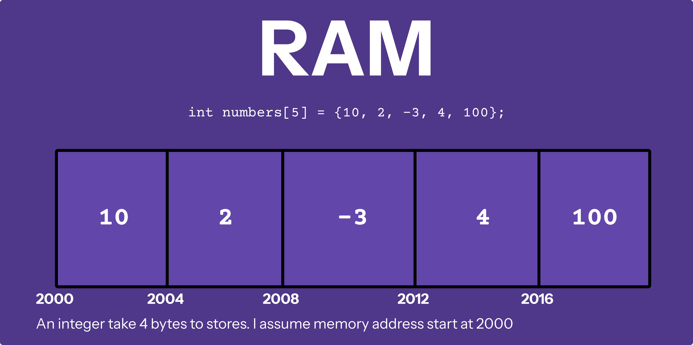
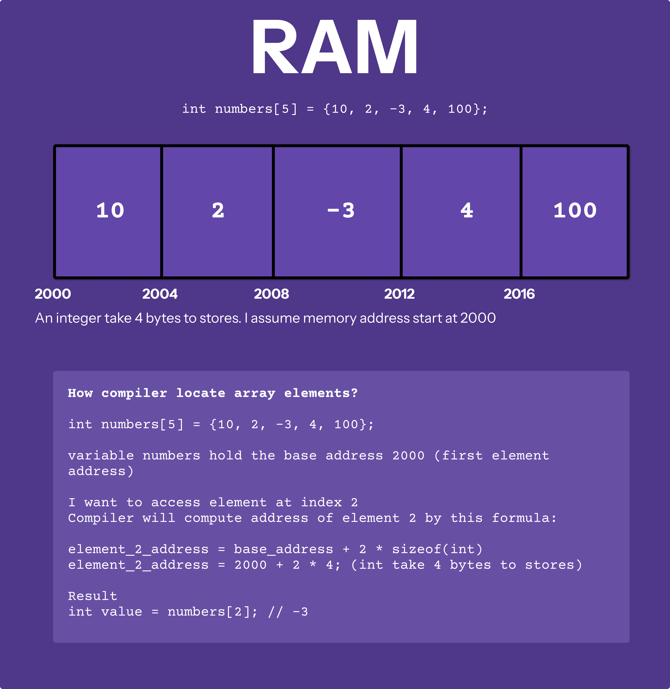

# Array

An **array** is a collection of elements of the **same type** stored in **contiguous memory locations**.

For example, an array of integers stores a series of integers values, while an array of floats stores a sequence of floating point numbers.

## 1. Declare and initialize Arrays

```c
int numbers[5]; // declare an array of 5 integers without initialize

// declare and initialize an array
// of 5 floating point numbers
float another_numbers[5] = {1.0, 2.0, 3.0, 4.0, 5.0};

for (int i = 0; i < 5; i++) {
  printf("%f\n", another_numbers[i]);
}

// declare and initialize an array of string that automatic calculation size
char days_of_week[] = {"Monday", "Tuesday", "Wednesday", "Thursday", "Friday", "Saturday", "Sunday"};

// declare and partly initialize
double humidities[5] = {0.4, 0.6}; // rest will automatically assign to 0.0
// [0.4, 0.6, 0.0, 0.0, 0.0]

 int partial[5] = {1, 2}; // rest will be 0 -> {1, 2, 0, 0, 0}
```

**Visualize how array stores elements**



## 2. Accessing Array Elements

**Index** is the key concept to know if you want to manipulate data into a data structure like an array, there are some following points on indexes in C:

* Indexes starts with `0` and the first element in an array is pointed by `0` index
* If an array has `n` elements then the valid index range is `0` to `n-1`

Example

```c
int arr[] = {10, 20, 30, 0};
printf("%d %d\n", arr[0], arr[2]); // 10 30
arr[2] = -50;
printf("%d %d\n", arr[0], arr[2]); // 10 -50
```


**How does indexing works internally?**

When you access an array element, C uses the array's base address (the address of the first element) and adds the index to find the memory location of the desired element. The size of each element is important here.

When you access `arr[2]`, the compiler internally computes the address of `arr[2]` and fetches the value of that index. How compiler calculates the address of `arr[2]`, compiler uses base address using array name `arr` and size of array data type `int = 4 bytes`

> **arr**: arr represent address of array (base_address)
>
> **arr[2]** address: base_address + 2 * sizeof(int)



Fun fact, because compiler locate array element via `base_address + 2 * sizeof(data_type)` so we can also access array elements by this way: `int value = 2[arr]; // access element 2 of array arr` . Weird to read but in theory you can switch **base_address** with **index** without chaning the computation results.

**Print address of an array**

```c
int arr[] = {10, 20, 30, 0};
printf("base address: %p\n", arr); // base address: 0x16f8c6ed0

int value_of_element_2 = arr[2]; // you can either use 2[arr] or arr[2]
printf("address of element 2: %p\n", &arr[2]); // address of element 2: 0x16f44eed8
printf("Value of element 2: %d\n", value_of_element_2); // Value of element 2: 30
```


**No out of bond checking**

In C, if you provide an invalid index, compiler does not check index is valid or not. It simply allows you, normal computation and returns a random value or this might be a memory location that is not allowed to be accessed by your program, in that may get some runtime error.

```c
int arr[] = {1, 9, 200, -21};
printf("Value of 20: %d", arr[20]); // output 0
```

The program's output is not fixed because accessing an out-of-bounds index can result in a random value or a runtime error.

**Therefore, it essential to verify that index is valid before accessing any element from the array.**

## 3. Size of an Array

In C, `sizeof(variable_name)` function is used to determine the size of an array. It returns the number of bytes allocated for that array.

```c
int arr[] = {10, 20, 30, 0};
printf("Size of arr: %zu", sizeof(arr)); // 16 because 4 elements * 4 bytes
```

To determine number of elements in an array, you can take `sizeof(array)`and then divided with `sizeof(data_type)` 

```c
int arr[] = {10, 20, 30, 0};
int number_of_elements = sizeof(arr)/sizeof(int);
// or
int number_of_elements = sizeof(arr)/sizeof(arr[0]);

printf("%d\n", number_of_elements); // 4 elements
```

## 4. Array Traversal

Array traversal is a common operation where we visit each element of an array.

For traversing, we need to know about the size of an array, using size we find what is a valid index range that we traverse the array.

We mainly use two ways to traverse an array:

* **For loop**

  ```c
  int arr[] = {10, 20, 30, 0};
  int elements = sizeof(arr)/sizeof(arr[0]);
  for (int i = 0; i < elements; i++) {
    printf("%d\n", arr[i]);
  }
  ```

  

* **While loop**

  ```c
  int arr[] = {10, 20, 30, 0};
  int elements = sizeof(arr)/sizeof(arr[0]);
  int count = 0;
  while (count < elements) {
    printf("%d\n", elements[count]);
    count++;
  }
  ```

## 5. Different types of Array

In C, arrays can be broadly categorized into two types **statically allocated arrays** and **dynamically allocated arrays**.

Both serve different purposes.

### 5.1 Statically Allocated Arrays

In C, statically allocated arrays are most common type of array. These arrays a fixed size, which must be determined at compile time. The creation of these arrays is in the funcion call stack when a function is called and destroyed automatically when the function exists or reads.

Example

```c
int arr[100];
char name[100];
int arr[] = {1, 2, 3, 4, 5};
```

### 5.2 Dynamically Allocated Arrays

In certain conditions, we want memory to remain available after the function exits. This can be achieved through dynamically allocated arrays.

In Java, we declare the array first without specifying the size of the array but it is not possible in C.

These arrays are created using **pointers**, and the programmer has control over when the memory is allocated and deallocated.

Arrays are allocated in the **heap memory** when you create using **pointers**.

Example

```c
int *arr[] = (int *) malloc(sizeof(int) *n);
```

There are two advantages to using dynamic allocated arrays:

- As a program you decide when memory is allocated and deallocated.
- These arrays are not deleted when function s terminate or exit

